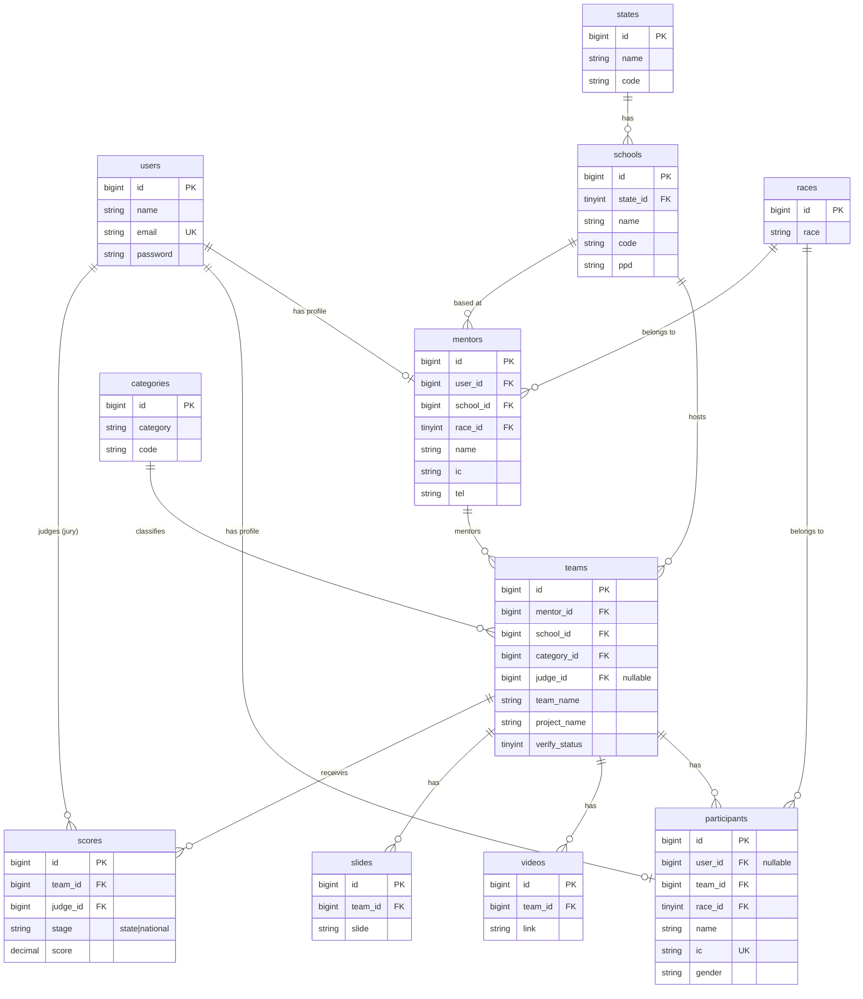

# Backend — Database Schema & Eloquent Relationships

> **Projek:** Junior Innovathon 2026 — RTM
> **Vendor:** Stream.My
> **Last updated:** 2026-05-31
> **Asas:** Dinormalisasi daripada database edisi terdahulu (`junior_innovathon_ori.sql`)
> **Konvensyen:** Nama **jadual, kolum, model, dan relationship — English**. Prosa penerangan BM.
> **Memenuhi:** § 3.2.5 (pendaftaran), § 3.6 (penjurian), § 3.2.5(c) (sijil)

Dokumen ini menetapkan skema pangkalan data dan pelan **Eloquent ORM relationship** untuk projek. Struktur diambil daripada database edisi lama, kemudian **dinormalisasi** kepada konvensyen Laravel: foreign key sebenar, penamaan `snake_case` + suffix `_id`, elak *reserved words*, dan diselaraskan dengan 5 role (Mentor / Participant / Jury / Admin / Public).

---

## Perubahan daripada edisi lama (normalisasi)

| Edisi lama | Baharu | Sebab |
|---|---|---|
| Kolum `mentor`, `school`, `team` (int biasa) | `mentor_id`, `school_id`, `team_id` + **FK** | Konvensyen Laravel + integriti rujukan |
| Tiada foreign key | `foreignId()->constrained()` | Elak *orphan records*, cascade betul |
| Reserved words `desc`, `table`, `primary`, `secondary` | `description`, `table_no`, `count_primary`, `count_secondary` | Elak backtick + konflik SQL |
| `mentors.userid`, `participants.related_id` | `users.id` FK (`user_id`) | Satu jadual `users` + Spatie role |
| `judge` (int) pada `teams` | `judge_id` → `users.id` (role `jury`) | Jury = User dengan role `jury` |
| Penjurian dalam kolum `teams` (`rank_state`, `rank_national`) | Jadual **`scores`** berasingan | § 3.6 saringan → studio; histori markah LED real-time |

---

## ERD (Mermaid)



---

## Pelan Relationship (ringkasan)

```
User (auth · Sanctum · Spatie roles)
 ├─ hasOne  Mentor        (role: mentor)
 ├─ hasOne  Participant   (role: participant)
 └─ hasMany Score         (role: jury — markah yang diberi)

State    ─hasMany→ School
School   ─hasMany→ Team, Mentor
Category ─hasMany→ Team
Race     ─hasMany→ Participant, Mentor

Mentor   ─hasMany→ Team
Team     ─belongsTo→ Mentor, School, Category, judge(User)
         ─hasMany→ Participant, Video, Slide, Score
```

---

## Definisi Model

### User

```php
// app/Models/User.php
class User extends Authenticatable
{
    use HasApiTokens, HasRoles, Notifiable;   // Sanctum + Spatie

    public function mentor(): HasOne
    {
        return $this->hasOne(Mentor::class);
    }

    public function participant(): HasOne
    {
        return $this->hasOne(Participant::class);
    }

    // markah yang diberi oleh user ini sebagai jury
    public function scores(): HasMany
    {
        return $this->hasMany(Score::class, 'judge_id');
    }
}
```

### Mentor (role: mentor — guru pembimbing)

```php
// app/Models/Mentor.php
class Mentor extends Model
{
    public function user(): BelongsTo   { return $this->belongsTo(User::class); }
    public function school(): BelongsTo { return $this->belongsTo(School::class); }
    public function race(): BelongsTo   { return $this->belongsTo(Race::class); }
    public function teams(): HasMany    { return $this->hasMany(Team::class); }
}
```

### Participant (role: participant — pelajar peserta)

```php
// app/Models/Participant.php
class Participant extends Model
{
    public function user(): BelongsTo { return $this->belongsTo(User::class); } // nullable
    public function team(): BelongsTo { return $this->belongsTo(Team::class); }
    public function race(): BelongsTo { return $this->belongsTo(Race::class); }
}
```

### Team (pasukan)

```php
// app/Models/Team.php
class Team extends Model
{
    public function mentor(): BelongsTo   { return $this->belongsTo(Mentor::class); }
    public function school(): BelongsTo   { return $this->belongsTo(School::class); }
    public function category(): BelongsTo { return $this->belongsTo(Category::class); }
    public function judge(): BelongsTo    { return $this->belongsTo(User::class, 'judge_id'); }

    public function participants(): HasMany { return $this->hasMany(Participant::class); }
    public function videos(): HasMany       { return $this->hasMany(Video::class); }
    public function slides(): HasMany       { return $this->hasMany(Slide::class); }
    public function scores(): HasMany       { return $this->hasMany(Score::class); }
}
```

### School

```php
// app/Models/School.php
class School extends Model
{
    public function state(): BelongsTo  { return $this->belongsTo(State::class); }
    public function teams(): HasMany    { return $this->hasMany(Team::class); }
    public function mentors(): HasMany  { return $this->hasMany(Mentor::class); }
}
```

### Score (baharu — penjurian berbilang peringkat)

```php
// app/Models/Score.php
class Score extends Model
{
    // stage: 'state' (saringan zon) | 'national' (studio)
    public function team(): BelongsTo  { return $this->belongsTo(Team::class); }
    public function judge(): BelongsTo { return $this->belongsTo(User::class, 'judge_id'); }
}
```

### Reference / leaf models

```php
// State.php
public function schools(): HasMany { return $this->hasMany(School::class); }

// Category.php
public function teams(): HasMany { return $this->hasMany(Team::class); }

// Race.php
public function participants(): HasMany { return $this->hasMany(Participant::class); }
public function mentors(): HasMany      { return $this->hasMany(Mentor::class); }

// Video.php / Slide.php
public function team(): BelongsTo { return $this->belongsTo(Team::class); }
```

---

## Contoh Migration (foreign key)

```php
// database/migrations/xxxx_create_teams_table.php
Schema::create('teams', function (Blueprint $table) {
    $table->id();
    $table->foreignId('mentor_id')->constrained()->cascadeOnDelete();
    $table->foreignId('school_id')->constrained();
    $table->foreignId('category_id')->constrained();
    $table->foreignId('judge_id')->nullable()->constrained('users');
    $table->string('team_name')->nullable();
    $table->string('project_name');
    $table->string('table_no', 20)->nullable();     // dulu `table`
    $table->text('description')->nullable();         // dulu `desc`
    $table->tinyInteger('verify_status')->default(2);
    $table->timestamp('verified_at')->nullable();
    $table->timestamps();
});
```

```php
// database/migrations/xxxx_create_scores_table.php
Schema::create('scores', function (Blueprint $table) {
    $table->id();
    $table->foreignId('team_id')->constrained()->cascadeOnDelete();
    $table->foreignId('judge_id')->constrained('users');
    $table->enum('stage', ['state', 'national']);     // saringan zon → studio
    $table->decimal('score', 6, 2);
    $table->json('rubric')->nullable();               // pecahan markah kriteria
    $table->timestamps();
    $table->unique(['team_id', 'judge_id', 'stage']); // satu markah / jury / peringkat
});
```

---

## Contoh penggunaan (eager loading)

```php
// Senarai pasukan untuk saringan zon — elak N+1
$teams = Team::with(['mentor', 'school.state', 'category', 'participants', 'videos'])
    ->where('verify_status', 1)
    ->get();

// Markah studio real-time untuk satu pasukan
$team = Team::with(['scores' => fn ($q) => $q->where('stage', 'national')])
    ->findOrFail($id);
```

---

## Nota reka bentuk / keputusan

1. **User ↔ profil (Mentor/Participant)** — satu jadual `users` (auth + Spatie role), profil demografi dalam jadual berasingan. `Participant.user_id` **nullable** (pelajar bawah umur mungkin tak perlu akaun login sendiri; boleh diuruskan oleh mentor).
2. **Score jadual berasingan** — bukan kolum dalam `teams`. Menyokong penjurian pelbagai jury, histori, dan LED real-time (§ 3.6.4).
3. **Schools (11,716 baris)** — boleh **import terus** daripada data lama (jimat Fasa 1). Data rujukan, bukan PII.
4. **PII** (`participants.ic`, `mentors.ic/tel/email`) — enkripsi at-rest (RDS KMS) + audit (middleware § 1.1). IC pelajar bawah umur = data sensitif kerajaan.
5. **Password lama TIDAK dibawa masuk** — lihat keputusan migrasi dalam `decisions-log.md`. Akaun baharu + set-password.

---

## Rujukan Spesifikasi

| Perkara | Spec § |
|---|---|
| Pendaftaran (team, participant, school lookup) | § 3.2.5 |
| Bahan pertandingan (video + slaid) | § 3.2.5 |
| Penjurian saringan zon + studio (scores) | § 3.6, § 3.6.4 |
| Sijil digital + verifikasi | § 3.2.5(c) |
| Serahan source code ke RTM | § 3.14 |
