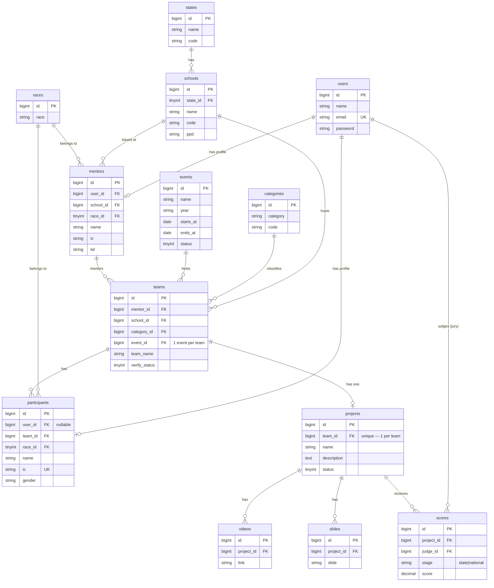

# Backend — Database Schema & Eloquent Relationships

> **Projek:** Junior Innovathon 2026 — RTM
> **Vendor:** Stream.My
> **Last updated:** 2026-05-31
> **Asas:** Dinormalisasi daripada database edisi terdahulu (`junior_innovathon_ori.sql`)
> **Konvensyen:** Nama **jadual, kolum, model, dan relationship — English**. Prosa penerangan BM.
> **Memenuhi:** § 3.2.5 (pendaftaran), § 3.6 (penjurian), § 3.2.5(c) (sijil)

Dokumen ini menetapkan skema pangkalan data dan pelan **Eloquent ORM relationship** untuk projek. Struktur diambil daripada database edisi lama, kemudian **dinormalisasi** kepada konvensyen Laravel: foreign key sebenar, penamaan `snake_case` + suffix `_id`, elak *reserved words*, dan diselaraskan dengan 7 role (Mentor / Participant / Jury / Scroller / Broadcaster / Admin / Public).

---

## Konsep domain teras: Event → Team → Project

| Entiti | Dicipta oleh | Peraturan |
|---|---|---|
| **Event** | **Admin** | Pertandingan (cth. "Junior Innovathon 2026"). Boleh ada banyak. |
| **Team** | **Mentor** (semasa pendaftaran) | Satu Team = satu Mentor + participants. **Team sertai TEPAT 1 Event.** Mentor & Participant terikat pada **satu Team sahaja** — tak boleh join Team lain. |
| **Project** | **Mentor** | **1 Team = 1 Project** (satu Project per Event). Project ialah karya yang dinilai (video + slaid + markah melekat di sini). |

```
Admin ──create──► Event
                    ▲
                    │ belongsTo (1 event per team)
Mentor ──register─► Team ──has one──► Project ──► Video, Slide, Score
                    │
                    └─ has many ──► Participant   (terikat, tak boleh pindah)
```

---

## Perubahan daripada edisi lama (normalisasi)

| Edisi lama | Baharu | Sebab |
|---|---|---|
| Kolum `mentor`, `school`, `team` (int biasa) | `mentor_id`, `school_id`, `team_id` + **FK** | Konvensyen Laravel + integriti rujukan |
| Tiada foreign key | `foreignId()->constrained()` | Elak *orphan records*, cascade betul |
| `teams` campur `teamname` + `project_name` | Pisah **`teams`** (kumpulan) vs **`projects`** (karya) | 1 Team = 1 Project; bahan/markah melekat pada Project |
| `event` (int, ada `-1`/NULL) pada `teams` | Jadual **`events`** + `teams.event_id` F, Admin-managed | Event jadi entiti sebenar; satu Event per Team |
| Reserved words `desc`, `table`, `primary`, `secondary` | `description`, `table_no`, `count_primary`, `count_secondary` | Elak backtick + konflik SQL |
| `mentors.userid`, `participants.related_id` | `users.id` FK (`user_id`) | Satu jadual `users` + Spatie role |
| `judge` (int) pada `teams` | `judge_id` → `users.id` (role `jury`) pada `scores` | Jury = User dengan role `jury` |
| Penjurian dalam kolum `teams` (`rank_state`, `rank_national`) | Jadual **`scores`** berasingan (rujuk Project) | § 3.6 saringan → studio; histori markah LED real-time |

---

## ERD (Mermaid)



---

## Pelan Relationship (ringkasan)

```
User (auth · Sanctum · Spatie roles)
 ├─ hasOne  Mentor        (role: mentor)
 ├─ hasOne  Participant   (role: participant)
 └─ hasMany Score         (role: jury — markah yang diberi)

State    ─hasMany→ School
School   ─hasMany→ Team, Mentor
Category ─hasMany→ Team
Race     ─hasMany→ Participant, Mentor

Admin    ─(manage)→ Event
Event    ─hasMany→ Team

Mentor   ─hasMany→ Team
Team     ─belongsTo→ Mentor, School, Category, Event
         ─hasOne→ Project
         ─hasMany→ Participant
Project  ─belongsTo→ Team
         ─hasMany→ Video, Slide, Score

JudgingSession  ─belongsTo→ scroller(User), Project(active)
                ─hasMany→ Score            (sesi live yang dipacu Scroller)
```

> **Team ↔ Event:** Team `belongsTo` **satu** Event (`event_id`). Mentor & Participant terikat pada satu Team — tiada pindah Team.
> **Team ↔ Project:** `hasOne` (1 Team = 1 Project). Video, Slide, dan Score melekat pada **Project**, bukan Team.
> **Role operasi (`scroller`, `broadcaster`, `admin`)** tiada jadual profil sendiri — mereka User dengan role Spatie sahaja. `scroller` memacu **`judging_sessions`** (pilih **Project** aktif → juri diberi UI markah); `broadcaster` hanya **membaca** markah gabungan (`scores`) sebagai overlay OBS (read-only, tiada tulisan DB).

### JudgingSession (baharu — kawalan sesi live oleh Scroller)

```php
// app/Models/JudgingSession.php
class JudgingSession extends Model
{
    // scroller pilih project aktif; status: waiting|scoring|revealed|closed
    public function scroller(): BelongsTo { return $this->belongsTo(User::class, 'scroller_id'); }
    public function project(): BelongsTo  { return $this->belongsTo(Project::class, 'active_project_id'); }
    public function scores(): HasMany     { return $this->hasMany(Score::class); }
}
```

> `Score` menambah `judging_session_id` (nullable) supaya markah studio live dikaitkan dengan sesi; markah saringan zon (offline) biarkan null.

---

## Definisi Model

### User

```php
// app/Models/User.php
class User extends Authenticatable
{
    use HasApiTokens, HasRoles, Notifiable;   // Sanctum + Spatie

    public function mentor(): HasOne
    {
        return $this->hasOne(Mentor::class);
    }

    public function participant(): HasOne
    {
        return $this->hasOne(Participant::class);
    }

    // markah yang diberi oleh user ini sebagai jury
    public function scores(): HasMany
    {
        return $this->hasMany(Score::class, 'judge_id');
    }
}
```

### Mentor (role: mentor — guru pembimbing)

```php
// app/Models/Mentor.php
class Mentor extends Model
{
    public function user(): BelongsTo   { return $this->belongsTo(User::class); }
    public function school(): BelongsTo { return $this->belongsTo(School::class); }
    public function race(): BelongsTo   { return $this->belongsTo(Race::class); }
    public function teams(): HasMany    { return $this->hasMany(Team::class); }
}
```

### Participant (role: participant — pelajar peserta)

```php
// app/Models/Participant.php
class Participant extends Model
{
    public function user(): BelongsTo { return $this->belongsTo(User::class); } // nullable
    public function team(): BelongsTo { return $this->belongsTo(Team::class); }
    public function race(): BelongsTo { return $this->belongsTo(Race::class); }
}
```

### Event (dicipta oleh Admin)

```php
// app/Models/Event.php
class Event extends Model
{
    // status: draft|open|screening|studio|closed
    public function teams(): HasMany { return $this->hasMany(Team::class); }
}
```

### Team (kumpulan — 1 Event, 1 Project)

```php
// app/Models/Team.php
class Team extends Model
{
    public function mentor(): BelongsTo   { return $this->belongsTo(Mentor::class); }
    public function school(): BelongsTo   { return $this->belongsTo(School::class); }
    public function category(): BelongsTo { return $this->belongsTo(Category::class); }
    public function event(): BelongsTo    { return $this->belongsTo(Event::class); }   // tepat 1 event

    public function participants(): HasMany { return $this->hasMany(Participant::class); }
    public function project(): HasOne       { return $this->hasOne(Project::class); }   // 1 team = 1 project
}
```

### Project (dicipta oleh Mentor — karya yang dinilai)

```php
// app/Models/Project.php
class Project extends Model
{
    // status: draft|submitted|verified
    public function team(): BelongsTo { return $this->belongsTo(Team::class); }

    public function videos(): HasMany { return $this->hasMany(Video::class); }
    public function slides(): HasMany { return $this->hasMany(Slide::class); }
    public function scores(): HasMany { return $this->hasMany(Score::class); }
}
```

### School

```php
// app/Models/School.php
class School extends Model
{
    public function state(): BelongsTo  { return $this->belongsTo(State::class); }
    public function teams(): HasMany    { return $this->hasMany(Team::class); }
    public function mentors(): HasMany  { return $this->hasMany(Mentor::class); }
}
```

### Score (baharu — penjurian berbilang peringkat)

```php
// app/Models/Score.php
class Score extends Model
{
    // stage: 'state' (saringan zon) | 'national' (studio)
    public function project(): BelongsTo { return $this->belongsTo(Project::class); }
    public function judge(): BelongsTo   { return $this->belongsTo(User::class, 'judge_id'); }
}
```

### Reference / leaf models

```php
// State.php
public function schools(): HasMany { return $this->hasMany(School::class); }

// Category.php
public function teams(): HasMany { return $this->hasMany(Team::class); }

// Race.php
public function participants(): HasMany { return $this->hasMany(Participant::class); }
public function mentors(): HasMany      { return $this->hasMany(Mentor::class); }

// Video.php / Slide.php
public function project(): BelongsTo { return $this->belongsTo(Project::class); }
```

---

## Contoh Migration (foreign key)

```php
// database/migrations/xxxx_create_events_table.php  (Admin-managed)
Schema::create('events', function (Blueprint $table) {
    $table->id();
    $table->string('name');                          // "Junior Innovathon 2026"
    $table->string('year', 4)->nullable();
    $table->date('starts_at')->nullable();
    $table->date('ends_at')->nullable();
    $table->tinyInteger('status')->default(0);       // draft|open|screening|studio|closed
    $table->timestamps();
});
```

```php
// database/migrations/xxxx_create_teams_table.php
Schema::create('teams', function (Blueprint $table) {
    $table->id();
    $table->foreignId('mentor_id')->constrained()->cascadeOnDelete();
    $table->foreignId('school_id')->constrained();
    $table->foreignId('category_id')->constrained();
    $table->foreignId('event_id')->constrained();    // tepat 1 event per team
    $table->string('team_name');
    $table->string('table_no', 20)->nullable();      // dulu `table`
    $table->tinyInteger('verify_status')->default(2);
    $table->timestamp('verified_at')->nullable();
    $table->timestamps();
});
```

```php
// database/migrations/xxxx_create_projects_table.php  (Mentor-created; 1 per team)
Schema::create('projects', function (Blueprint $table) {
    $table->id();
    $table->foreignId('team_id')->unique()->constrained()->cascadeOnDelete(); // 1 team = 1 project
    $table->string('name');                          // dulu teams.project_name
    $table->text('description')->nullable();          // dulu teams.desc
    $table->tinyInteger('status')->default(0);        // draft|submitted|verified
    $table->timestamps();
});
```

```php
// database/migrations/xxxx_create_scores_table.php
Schema::create('scores', function (Blueprint $table) {
    $table->id();
    $table->foreignId('project_id')->constrained()->cascadeOnDelete();
    $table->foreignId('judge_id')->constrained('users');
    $table->enum('stage', ['state', 'national']);     // saringan zon → studio
    $table->decimal('score', 6, 2);
    $table->json('rubric')->nullable();               // pecahan markah kriteria
    $table->timestamps();
    $table->unique(['project_id', 'judge_id', 'stage']); // satu markah / jury / peringkat
});
```

> Video & Slide migration merujuk `project_id` (bukan `team_id`).

---

## Contoh penggunaan (eager loading)

```php
// Senarai project untuk saringan zon dalam satu Event — elak N+1
$projects = Project::with(['team.mentor', 'team.school.state', 'team.category', 'videos'])
    ->whereHas('team', fn ($q) => $q->where('event_id', $eventId)->where('verify_status', 1))
    ->get();

// Markah studio real-time untuk satu project
$project = Project::with(['scores' => fn ($q) => $q->where('stage', 'national')])
    ->findOrFail($id);
```

---

## Nota reka bentuk / keputusan

1. **User ↔ profil (Mentor/Participant)** — satu jadual `users` (auth + Spatie role), profil demografi dalam jadual berasingan. `Participant.user_id` **nullable** (pelajar bawah umur mungkin tak perlu akaun login sendiri; boleh diuruskan oleh mentor).
2. **Score jadual berasingan** — bukan kolum dalam `teams`. Menyokong penjurian pelbagai jury, histori, dan LED real-time (§ 3.6.4).
3. **Schools (11,716 baris)** — boleh **import terus** daripada data lama (jimat Fasa 1). Data rujukan, bukan PII.
4. **PII** (`participants.ic`, `mentors.ic/tel/email`) — enkripsi at-rest (RDS KMS) + audit (middleware § 1.1). IC pelajar bawah umur = data sensitif kerajaan.
5. **Password lama TIDAK dibawa masuk** — lihat keputusan migrasi dalam `decisions-log.md`. Akaun baharu + set-password.
6. **Event / Team / Project** — Admin cipta **Event**; Mentor daftar **Team** (terikat pada 1 Event, `event_id`) dan cipta **Project** (`hasOne`, 1 per team). Bahan (Video/Slide) & markah (Score) melekat pada **Project**. Kuatkuasa "1 team 1 event 1 project" via `teams.event_id` (bukan nullable) + `projects.team_id` **unique**.
7. **Peserta terikat** — Mentor & Participant tak boleh pindah Team; kuatkuasa di peringkat Service (semak Team sedia ada sebelum benarkan cipta/join).

---

## Rujukan Spesifikasi

| Perkara | Spec § |
|---|---|
| Pendaftaran (team, participant, school lookup) | § 3.2.5 |
| Bahan pertandingan (video + slaid) | § 3.2.5 |
| Penjurian saringan zon + studio (scores) | § 3.6, § 3.6.4 |
| Sijil digital + verifikasi | § 3.2.5(c) |
| Serahan source code ke RTM | § 3.14 |
