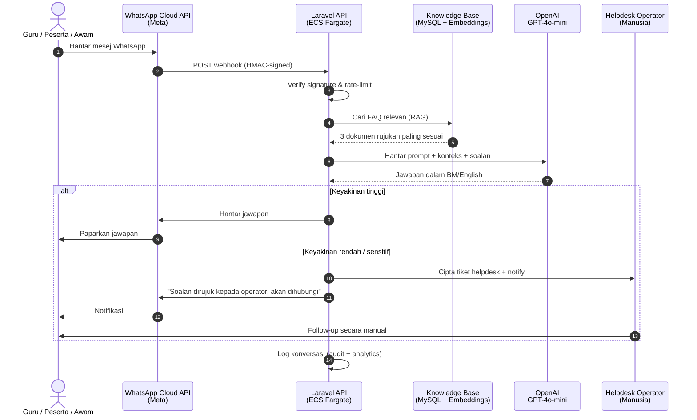

# AI FAQ Chatbot — Cadangan Pelaksanaan

### WhatsApp Business API (Meta) × Laravel API × OpenAI GPT-4o-mini

> **Bahagian daripada:** StreamDotMy CMS untuk Junior Innovathon 2026
> **Memenuhi spec §:** 3.4.1, 3.4.2, 3.4.3, 3.7.3(d), 3.8.1
> **Rujukan dokumen:** [`cms-brochure.md`](./cms-brochure.md) · [`aws-architecture.md`](./aws-architecture.md)

---

## Masalah

Spec § 3.4.1 menetapkan keperluan ini:

> *"Mewujudkan satu system auto reply menerusi aplikasi chatbot, whatsapp atau telegram di portal bagi menjawab segala persoalan mahupun maklumat mengenai pertandingan Junior Innovathon bermula dari awal sehingga selesai pertandingan termasuk hal hal bayaran, info pelajar, konsep pertandingan dan lain lain."*

Dengan **anggaran 5,000 pasukan dari sekolah seluruh Malaysia**, dijangka 15,000–25,000 soalan akan diterima sepanjang program — dari guru pengiring (jadual, peraturan, prosedur muat naik), peserta (status saringan, sijil), dan orang awam (tonton siaran, lokasi studio). Helpdesk manual **tidak boleh handle volume ini** tanpa pasukan customer service besar-besaran.

Spec § 3.4.2 mewajibkan **AI Engine terkini dengan kemampuan model "ask and reply"** — bukan chatbot template biasa yang hanya boleh menjawab soalan yang dikod secara manual.

---

## Penyelesaian

Sistem chatbot AI tiga-komponen:

1. **WhatsApp Business Cloud API** (oleh Meta) — saluran utama, sebab 98% guru Malaysia menggunakan WhatsApp setiap hari.
2. **Laravel API webhook** — penerima mesej, business logic, audit logging, dan eskalasi ke human helpdesk apabila perlu.
3. **OpenAI GPT-4o-mini dengan RAG** — pemproses bahasa semula jadi yang menjawab soalan dalam BM dan English, dengan rujukan kepada knowledge base rasmi Junior Innovathon.



**Telegram** menggunakan corak yang sama melalui [Telegram Bot API](https://core.telegram.org/bots/api) — endpoint webhook berbeza, business logic sama.

---

## Senibina Teknikal

### Webhook flow (Laravel)

```php
// routes/api.php
Route::post('/webhooks/whatsapp', [WhatsAppWebhookController::class, 'handle'])
    ->middleware('verify.whatsapp.signature');

Route::post('/webhooks/telegram', [TelegramWebhookController::class, 'handle'])
    ->middleware('verify.telegram.token');
```

**Verifikasi keselamatan webhook:**
- WhatsApp: HMAC SHA-256 signature pada header `X-Hub-Signature-256`, validated dengan **App Secret** dari Meta
- Telegram: secret token pada URL path (`/webhooks/telegram/{secret}`)
- Rate limiting per nombor telefon (10 mesej/minit) untuk elak abuse

**Processing pipeline:**

```php
// app/Jobs/ProcessChatbotMessageJob.php
class ProcessChatbotMessageJob implements ShouldQueue
{
    public function handle(
        ChatbotService $chatbot,
        KnowledgeBaseService $kb,
        OpenAIService $openai
    ): void {
        // 1. Cari konteks relevan dari KB (RAG)
        $context = $kb->retrieve($this->message, limit: 3);

        // 2. Hantar ke OpenAI dengan system prompt + konteks
        $reply = $openai->chat(
            systemPrompt: $this->buildSystemPrompt($context),
            userMessage: $this->message,
            sessionId: $this->session->id,
        );

        // 3. Jawapan keyakinan rendah → eskalasi
        if ($reply->confidence < 0.6 || $reply->requiresHuman) {
            HelpdeskTicket::createFromChatbot($this->session, $reply);
            $this->sendEscalationNotice();
            return;
        }

        // 4. Hantar jawapan kembali via channel
        $this->channel->send($this->session->external_id, $reply->text);

        // 5. Log untuk audit + analytics
        ChatbotLog::record($this->session, $this->message, $reply);
    }
}
```

### Knowledge Base + RAG

**FAQ knowledge base** disimpan dalam MySQL dengan format struktur:

| Kolum | Jenis | Tujuan |
|---|---|---|
| `id` | bigint | Primary key |
| `category` | enum | pendaftaran / penjurian / hadiah / siaran / teknikal |
| `question_bm` | text | Soalan dalam BM |
| `question_en` | text | Soalan dalam English |
| `answer_bm` | text | Jawapan dalam BM |
| `answer_en` | text | Jawapan dalam English |
| `embedding` | JSON | Vector embedding (1536 dimensi) dari `text-embedding-3-small` |
| `priority` | smallint | Berat dalam pemilihan |
| `is_active` | bool | Toggle pentadbir |

**Retrieval flow (RAG):**

1. User message → embedding via OpenAI `text-embedding-3-small` (1536d, $0.020/1M tokens)
2. **Cosine similarity** terhadap semua KB entries (boleh guna MySQL `JSON_VALUE` + UDF, atau cache di Redis untuk kelajuan)
3. Pilih top-3 entries dengan similarity > 0.7
4. Bina prompt: `system + 3× context + user message`
5. Hantar ke GPT-4o-mini, dapatkan jawapan

**Alternatif:** Jika KB membesar (>1000 entries), beralih kepada **OpenAI Assistants API** dengan `file_search` tool — OpenAI uruskan chunking, embedding, dan retrieval secara automatik. Tiada perubahan UX, tukar backend sahaja.

### Sistem Prompt (BM-aware)

```
Anda adalah pembantu rasmi Program Realiti Junior Innovathon 2026,
anjuran Jabatan Penyiaran Malaysia (RTM).

Peraturan jawapan:
1. Jawab dalam bahasa yang sama dengan soalan pengguna (BM atau English).
2. Gunakan HANYA maklumat yang disediakan dalam KONTEKS di bawah.
3. Jika maklumat tidak ada dalam konteks, jawab: "Maaf, saya akan rujuk kepada operator untuk maklumat ini" — jangan reka jawapan.
4. Tone: mesra, profesional, sesuai untuk guru sekolah dan pelajar.
5. Untuk soalan teknikal sistem (login, upload), bantu dengan langkah berperingkat.
6. Untuk soalan sensitif (No. KP, kewangan peribadi), MINTA pengguna jangan kongsi dalam chat dan eskalasi ke helpdesk.
7. Jangan dakwa keputusan rasmi — sentiasa tambah disclaimer "Maklumat ini tertakluk kepada pengesahan rasmi RTM."

KONTEKS DARI KNOWLEDGE BASE:
{context}

SOALAN PENGGUNA: {message}
```

---

## Ciri-Ciri Utama

### 1. Multi-bahasa Automatik
Sistem mengesan bahasa pengguna (BM/English/campuran) dan menjawab dalam bahasa yang sama. Tiada perlu butang "tukar bahasa" — UX seperti berborak dengan manusia.

### 2. Operasi 24/7
Tiada masa rehat. Sesuai untuk guru yang menyemak status pendaftaran selepas waktu pejabat, atau peserta yang ada soalan pada hujung minggu.

### 3. Eskalasi Automatik ke Helpdesk
Apabila chatbot tidak yakin dengan jawapan, sistem **tidak meneka** — sebaliknya cipta tiket helpdesk dengan transcript lengkap dan notify operator manusia. Pengguna dimaklumkan dan akan dihubungi semula.

### 4. Pengurusan KB oleh Admin
SuperAdmin boleh tambah, edit, padam entri FAQ melalui dashboard CMS. Tidak perlu deployment kod. Embedding dijana semula secara automatik apabila entri diubah.

### 5. Audit & Compliance
Setiap interaksi dilog dengan timestamp, nombor telefon, mesej masuk, mesej keluar, intent dipadankan, dan confidence score. Memenuhi **§ 2.1.7** (Akta Rahsia Rasmi) dan **§ 3.12** (audit).

### 6. Penapis PII
Sebelum mesej dihantar ke OpenAI, sistem **secara automatik tutup** nombor KP, alamat penuh, nombor kad bank — corak regex Malaysia-specific. Pengguna juga diingatkan untuk tidak kongsi maklumat sensitif.

### 7. Analytics Dashboard
- Jumlah konversasi per hari
- Kategori soalan paling popular
- Soalan yang **tidak dijawab** chatbot (untuk tambah KB)
- Purata response time
- Rating kepuasan pengguna (👍/👎 selepas setiap jawapan)
- Bilangan eskalasi ke helpdesk

### 8. Caching Pintar
Jawapan untuk soalan biasa di-cache di Redis selama 1 jam — mengurangkan kos OpenAI dan tempoh respons. Cache invalidated automatik apabila KB diubah.

---

## Kos Operasi

### WhatsApp Business Cloud API (Meta)

Meta menggunakan model **bayar-per-konversasi** (24-jam window):

| Jenis | Kadar Malaysia |
|---|---|
| Service conversation (user mulakan) | ~USD 0.0259 |
| Marketing | tidak digunakan |
| Utility | tidak digunakan |
| 1,000 free service conversations/bulan | **Free tier** |

**Anggaran Junior Innovathon (6 bulan):**
- ~25,000 konversasi sepanjang program ÷ 6 bulan = ~4,000/bulan
- 1,000 free + 3,000 berbayar = 3,000 × $0.0259 = **~USD 78/bulan**
- Jumlah program: **~USD 470 (~RM 2,200)**

### OpenAI GPT-4o-mini

| Item | Kadar |
|---|---|
| Input | $0.150 / 1M tokens |
| Output | $0.600 / 1M tokens |
| Embeddings (`text-embedding-3-small`) | $0.020 / 1M tokens |

**Anggaran Junior Innovathon:**
- Purata 700 tokens per konversasi (500 input + 200 output)
- 25,000 konversasi × 700 = 17.5M tokens
- Kos input: ~$2.50
- Kos output: ~$3.00
- Embeddings (KB + queries): ~$5
- **Jumlah program: ~USD 15 (~RM 70)**

OpenAI sangat murah berbanding nilai automasi yang dihasilkan.

### Telegram Bot API

**Free** — Telegram tidak caj untuk Bot API.

### Anggaran Operasi Total Chatbot

| Komponen | Kos Program (6 bulan) |
|---|---|
| WhatsApp Cloud API | ~RM 2,200 |
| OpenAI | ~RM 70 |
| Telegram | RM 0 |
| AWS compute (sudah dalam ECS Fargate, tiada tambahan) | RM 0 |
| **Total** | **~RM 2,270** |

Berbanding dengan kos 1 operator helpdesk penuh masa (~RM 3,500/bulan × 6 = RM 21,000), chatbot menjimatkan **~RM 19,000** sambil memberikan respons 24/7.

---

## Pelaksanaan & Timeline

Pelaksanaan terangkum dalam **Fasa 5 — CMS + Chatbot** dalam [`jadual-pelaksanaan.md`](./jadual-pelaksanaan.md), bermula **18 Julai 2026**:

| Hari | Aktiviti |
|---|---|
| 1 | Permohonan WhatsApp Business akaun Meta + verifikasi nombor |
| 2 | Setup OpenAI organization + API key dalam AWS Secrets Manager |
| 3–4 | Pembangunan webhook controllers + signature verification |
| 5 | Sistem RAG: skema KB + embedding generation |
| 6–8 | Integrasi OpenAI + system prompt tuning |
| 9–10 | Integrasi Telegram Bot |
| 11 | Admin dashboard untuk pengurusan KB |
| 12 | Eskalasi flow ke helpdesk |
| 13–14 | UAT internal + populate KB dengan 100+ FAQ asal |

**Prasyarat sebelum Fasa 5:**
- WhatsApp Business permohonan dimulakan **sebelum SST** (proses Meta ambil masa 1–2 minggu)
- OpenAI API key + payment method standby

---

## Kepatuhan dengan Spesifikasi

| Spec § | Keperluan | Bagaimana dipenuhi |
|---|---|---|
| **3.4.1** | Auto-reply via chatbot, WhatsApp, atau Telegram | WhatsApp + Telegram + web widget — tiga saluran |
| **3.4.1** | Menjawab dari awal sehingga selesai pertandingan | Sistem aktif 24/7 sepanjang tempoh kontrak |
| **3.4.1** | Termasuk hal-hal bayaran, info pelajar, konsep | KB dipopulate dengan kategori: pendaftaran, penjurian, hadiah, siaran, teknikal |
| **3.4.2** | AI Engine terkini, kemampuan "ask and reply" | OpenAI GPT-4o-mini (Jan 2026 latest) dengan RAG, bukan template |
| **3.4.2** | Pentadbiran chatbot oleh admin | Dashboard CMS untuk CRUD KB + intent management |
| **3.4.3** | Integrasi peranti mudah alih + WhatsApp/Telegram | WhatsApp Cloud API + Telegram Bot API + web widget responsif |
| **3.7.3(d)** | Dashboard untuk AI ChatBot | Analytics dashboard dengan 6 metrik utama (lihat ciri #7) |
| **3.8.1** | Helpdesk + sokongan teknikal | Eskalasi automatik ke helpdesk dengan transcript lengkap |
| **2.1.7** | Akta Rahsia Rasmi | Audit log lengkap, PII filtering sebelum hantar ke OpenAI |
| **3.11.4(b)** | Security audit setiap suku tahun | Webhook signature verification + rate limiting + audit trail |

---

## Mengapa Kombinasi Ini

| Pilihan | Rasional |
|---|---|
| **WhatsApp** sebagai saluran utama | 98% guru Malaysia menggunakannya setiap hari; tiada perlu install app baru; native push notification |
| **Meta Cloud API** (bukan WhatsApp Business Solution Provider) | Direct dari Meta, lebih murah (~70% saving vs BSP), Meta-managed infrastructure, free 1,000 conv/bulan |
| **Laravel API** sebagai middleware | Konsisten dengan stack lain (audit, queue, RBAC), boleh customize business logic, on-call eskalasi |
| **OpenAI GPT-4o-mini** | Latest model (Jan 2026), murah, sangat baik untuk BM, RAG-friendly, opt-out training default |
| **MySQL + JSON embeddings** | Tiada vector DB tambahan; consistent dengan storage utama; cukup pantas untuk <1000 KB entries |
| **Eskalasi ke helpdesk** | Memastikan **tiada soalan tertinggal** — chatbot tidak meneka; kepercayaan tinggi penting untuk gov platform |

---

## Risiko & Mitigasi

| Risiko | Impak | Mitigasi |
|---|---|---|
| Permohonan WhatsApp Business akaun ditolak Meta | Saluran utama tidak boleh aktif | Mohon pra-SST; fallback ke Telegram + web widget jika lambat |
| OpenAI API down / kuota habis | Chatbot tidak boleh jawab | Status page monitoring + fallback ke "keyword-match" mod + eskalasi terus ke helpdesk |
| Halusinasi (chatbot reka jawapan) | Maklumat salah kepada peserta | Strict system prompt + confidence threshold + KB-only retrieval; tone "Maklumat tertakluk kepada pengesahan rasmi RTM" |
| Pengguna kongsi PII | Pelanggaran privasi | Regex filter automatic + amaran pra-chat + audit log untuk forensik |
| Trafik tiba-tiba tinggi (viral) | Kos OpenAI melonjak | CloudWatch billing alarm + rate limit per nombor + caching Redis untuk soalan biasa |
| OpenAI data residency (US) | Concerns kerajaan | PII filter sebelum hantar; fallback ke **Azure OpenAI Singapore** jika RTM menuntut data residency yang lebih ketat |

---

## Penutup

Cadangan ini menyepadukan **tiga teknologi tahap pengeluaran** — WhatsApp Cloud API oleh Meta, Laravel API yang teruji dalam projek RTM sedia ada ([`cms-usage.md`](./cms-usage.md)), dan OpenAI GPT-4o-mini sebagai LLM terkini. Sistem ini direka untuk **automasi total** terhadap soalan FAQ Junior Innovathon 2026, dengan **eskalasi pintar** kepada operator manusia apabila perlu — memastikan **tiada pengguna tertinggal** sepanjang program.

Stream.My telah membuktikan integrasi OpenAI dalam pengeluaran melalui projek **i-SYAEMS / Hotline JAIS** ([`cms-usage.md`](./cms-usage.md#6-i-syaems--hotline-jais)) — corak yang sama akan diaplikasikan dengan tweaks khusus untuk konteks Junior Innovathon.

---

*Dokumen ini disediakan sebagai sokongan kepada Technical Proposal, memenuhi keperluan § 3.4 sebut harga.*
