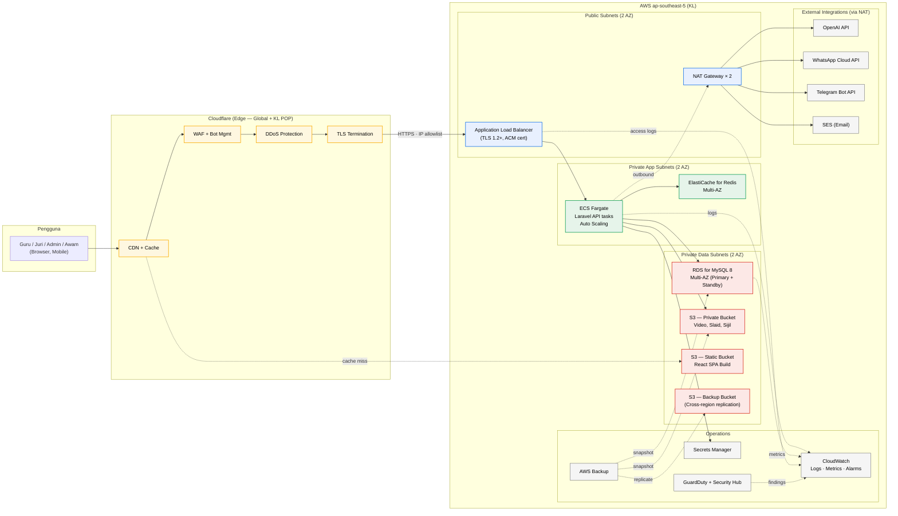

# Senibina AWS — Junior Innovathon 2026

> **Status:** Draft v1 — pelan senibina cloud.
> **Region:** **AWS Asia Pacific (Malaysia) — `ap-southeast-5`** (Kuala Lumpur)
> **Pendekatan:** AWS Well-Architected Framework (6 pillars) sebagai panduan.
> **Rujukan terkait:** [`diagram-sistem.md`](./diagram-sistem.md), [`jadual-perkhidmatan.md`](./jadual-perkhidmatan.md), [`jadual-pelaksanaan.md`](./jadual-pelaksanaan.md).

---

## Konteks

Sistem Junior Innovathon 2026 akan dihos sepenuhnya di **AWS Asia Pacific (Malaysia) Region** (`ap-southeast-5`, KL) untuk memenuhi keperluan **data residency** kerajaan Malaysia dan **Akta Rahsia Rasmi Kerajaan Malaysia** (§ 2.1.7). Senibina mengikuti **AWS Well-Architected Framework** dengan tumpuan kepada 6 pillar: Operational Excellence, Security, Reliability, Performance Efficiency, Cost Optimization, dan Sustainability.

Cloudflare digunakan sebagai **edge layer** (CDN, WAF, DDoS protection) di hadapan AWS untuk:
- Caching global (mengurangkan beban pada origin AWS)
- DDoS protection lebih agresif (free tier yang generous)
- WAF dengan rule sets sesuai untuk aplikasi awam

Origin AWS dalam ap-southeast-5 memastikan **semua data peserta, video penyertaan, dan markah penjurian disimpan dan diproses dalam negara**.

---

## Senibina Tahap Tinggi



---

## Inventori Perkhidmatan AWS

| Komponen | Perkhidmatan AWS | Spesifikasi awal | Spec § |
|---|---|---|---|
| API compute | **ECS Fargate** | 2 tasks × (2 vCPU, 4 GB), auto-scale 2–10 | 3.5.1, 3.2.4 |
| Load balancer | **Application Load Balancer (ALB)** | Multi-AZ, target group ke ECS | 3.5.1 |
| Database | **RDS for MySQL 8.0** | `db.t4g.medium` Multi-AZ, 100 GB gp3, 7-day backup retention | 3.5.1, 3.5.2 |
| Cache & queue | **ElastiCache for Redis 7.x** | `cache.t4g.small` Multi-AZ | 3.5.1 |
| Object storage (private) | **S3 Standard** | Bucket: `jr-innovathon-uploads` (versioned, encrypted) | 3.5.1 |
| Static hosting | **S3 Standard** | Bucket: `jr-innovathon-spa` (origin untuk Cloudflare) | 3.1.3 |
| Backup storage | **S3 Glacier Instant Retrieval** | Bucket: `jr-innovathon-backup` (cross-region replication ke ap-southeast-1) | 3.11.4(a) |
| DNS authoritative | **Route 53** | Hosted zone untuk `juniorinnovathon.rtm.gov.my` | 3.8.1(f) |
| TLS certificate | **AWS Certificate Manager (ACM)** | DV cert auto-renew, attached ke ALB | 3.8.1(f) |
| Secrets | **AWS Secrets Manager** | DB password, OpenAI API key, WhatsApp token, Telegram token | 3.8.1, 3.14 |
| Configuration | **Systems Manager Parameter Store** | Non-secret config (feature flags, URLs) | 3.7.3 |
| Logs | **CloudWatch Logs** | Log groups per ECS service, 30-day retention; export bulanan ke S3 | 3.11.4, 3.12 |
| Metrics & alarms | **CloudWatch Metrics + Alarms** | 5xx rate, latency, RDS CPU, Redis evictions, SLA breach | 3.11.3, 3.11.4 |
| Tracing | **AWS X-Ray** | Distributed tracing untuk debug | 3.11.4(d) |
| Threat detection | **GuardDuty** | 24/7 anomaly detection (memenuhi § 3.8.1(g)) | 3.8.1(g) |
| Security posture | **Security Hub** + **AWS Config** | CIS AWS Foundations Benchmark, PCI-DSS rules | 3.8.1, 3.11.4(b) |
| Backup orchestration | **AWS Backup** | Policy: harian, mingguan, bulanan untuk RDS + S3 | 3.11.4(a) |
| Patching | **Systems Manager Patch Manager** | Auto-patch ECS task images mingguan | 3.11.4(c) |
| Admin access | **Systems Manager Session Manager** | No SSH bastion; IAM-gated terminal | 3.8.1(g) |
| Email | **Simple Email Service (SES)** | Pendaftaran, verification, notifications | 3.2.5 |
| Container registry | **ECR** | Private repo untuk image Laravel | — |
| CI/CD | **GitHub Actions** + **AWS OIDC** | Push image ke ECR, deploy ke ECS | 3.13 |
| Edge (CDN/WAF/DDoS) | **Cloudflare** (di luar AWS) | Plan: Business (~USD 240/bulan); WAF rules, bot mgmt, Argo | 3.8.1(f)(g) |

---

## Topologi Rangkaian (VPC)

```
VPC: 10.0.0.0/16 (ap-southeast-5)
│
├── Availability Zone A (ap-southeast-5a)
│   ├── Public Subnet      10.0.1.0/24    → ALB, NAT Gateway A
│   ├── Private App Subnet 10.0.11.0/24   → ECS Fargate tasks
│   └── Private Data Subnet 10.0.21.0/24  → RDS Primary, Redis Primary
│
└── Availability Zone B (ap-southeast-5b)
    ├── Public Subnet      10.0.2.0/24    → ALB, NAT Gateway B
    ├── Private App Subnet 10.0.12.0/24   → ECS Fargate tasks (scaled)
    └── Private Data Subnet 10.0.22.0/24  → RDS Standby, Redis Replica
```

**Security Groups (least privilege):**

| Security Group | Inbound | Outbound |
|---|---|---|
| `sg-alb` | 443 from **Cloudflare IPs only** | 443 → `sg-ecs` |
| `sg-ecs` | 8080 from `sg-alb` | 3306 → `sg-rds`, 6379 → `sg-redis`, 443 → 0.0.0.0/0 (via NAT) |
| `sg-rds` | 3306 from `sg-ecs` | (none) |
| `sg-redis` | 6379 from `sg-ecs` | (none) |

**VPC Endpoints** (cost optimization + security):
- S3 Gateway Endpoint — ECS → S3 tanpa keluar internet (jimat NAT egress)
- Secrets Manager Interface Endpoint
- ECR Interface Endpoints (api + dkr)
- CloudWatch Logs Interface Endpoint

**VPC Flow Logs** — diaktifkan, dieksport ke CloudWatch Logs untuk audit (§ 3.12).

---

## Senibina Keselamatan

### Encryption

| Where | Mechanism |
|---|---|
| **In transit (external)** | TLS 1.2+ enforced di Cloudflare → ALB (Strict Origin Pull dengan ACM cert) |
| **In transit (internal)** | TLS untuk RDS dan ElastiCache; HTTPS antara ECS dan S3 |
| **At rest (RDS)** | AWS KMS encryption (CMK customer-managed) |
| **At rest (ElastiCache)** | KMS encryption + AUTH token dari Secrets Manager |
| **At rest (S3)** | SSE-KMS dengan CMK; bucket policy deny upload tanpa encryption |
| **At rest (EBS untuk ECS)** | Default KMS encryption |
| **Backups** | KMS encryption (key berbeza dari production) |

### IAM Strategy

- **Pengguna sistem** (Guru, Juri, Admin, Awam) — auth via Laravel Sanctum (cookie-based), bukan IAM.
- **Infrastruktur** — IAM roles only, **no long-lived IAM users**:
  - `ECSTaskRole` — read Secrets Manager, write CloudWatch, read/write specific S3 prefixes
  - `ECSTaskExecutionRole` — pull image dari ECR, write logs
  - `BackupRole` — AWS Backup managed
  - `GitHubActionsRole` — OIDC trust dengan GitHub, deploy permission terhad
- **Akses operator** — IAM Identity Center (formerly SSO) dengan MFA wajib; akses melalui Session Manager (audited).
- **Least privilege** — semua role gunakan inline policies dengan resource-level permissions, tiada `*` ARN.

### Secrets Management

Semua secret disimpan di **AWS Secrets Manager**, dengan automatic rotation untuk:
- DB master password (RDS managed rotation, setiap 30 hari)
- API keys (OpenAI, WhatsApp, Telegram) — rotation manual setiap suku tahun

Tiada secret dalam code, environment file, atau Parameter Store.

### Audit & Compliance

| Komponen | Tujuan | Spec § |
|---|---|---|
| **CloudTrail** | Semua API call ke AWS dilog; trail multi-region, dihantar ke S3 + CloudWatch | § 2.1.7, § 3.12 |
| **VPC Flow Logs** | Trafik rangkaian untuk forensik | § 3.8.1(g) |
| **Config** | Compliance terhadap CIS Benchmark; auto-remediation untuk drift | § 3.11.4(b) |
| **GuardDuty** | Anomaly detection (EC2, IAM, S3, Kubernetes) — 24/7 | § 3.8.1(g) |
| **Security Hub** | Aggregator untuk Config + GuardDuty + Inspector findings | § 3.8.1(g) |
| **Inspector** | Scan vulnerability untuk container images | § 3.11.4(c) |

---

## Reliability & Disaster Recovery

### Multi-AZ untuk semua tier kritikal

| Layer | Multi-AZ strategy |
|---|---|
| ALB | Cross-zone load balancing |
| ECS Fargate | Tasks tersebar across 2 AZ (capacity provider strategy) |
| RDS MySQL | Multi-AZ Standby (synchronous replica di AZ kedua, auto-failover ~60s) |
| ElastiCache Redis | Multi-AZ replication group dengan auto-failover |
| S3 | Native multi-AZ (managed AWS) |
| NAT Gateway | 1 NAT per AZ (high availability) |

### Backup Strategy (§ 3.11.4(a))

**AWS Backup centralised plan:**

| Sumber | Frekuensi | Retensi | Cross-region? |
|---|---|---|---|
| RDS MySQL snapshot | Harian (02:00 MYT) | 7 hari | Ya, ap-southeast-1 |
| RDS MySQL snapshot | Mingguan (Ahad) | 12 minggu | Ya, ap-southeast-1 |
| RDS MySQL snapshot | Bulanan (1hb) | 12 bulan | Ya, ap-southeast-1 |
| S3 uploads bucket | Continuous (replication) | (perpetual) | Ya, ap-southeast-1 |
| S3 versioning | Object versions | 90 hari | Native |
| EBS (jika digunakan) | Harian | 30 hari | Ya |

Backup encryption: KMS CMK berasingan, lock policy untuk elak deletion.

### RTO / RPO Target

| Scenario | RTO (Recovery Time) | RPO (Recovery Point) |
|---|---|---|
| ECS task crash | < 30 saat (auto-restart) | 0 |
| AZ failure | < 2 minit (ALB + RDS Multi-AZ failover) | < 5 saat |
| Region failure | < 4 jam (manual failover ke ap-southeast-1 standby) | < 1 jam |
| Database corruption | < 1 jam (point-in-time restore RDS) | < 5 minit |
| S3 object deletion (accidental) | < 5 minit (versioning restore) | 0 |

### Failover Playbook

Disimpan dalam `docs/runbooks/disaster-recovery.md` (akan ditulis kemudian). Mengandungi langkah-langkah untuk:
1. Detect (CloudWatch alarms)
2. Diagnose (Health Dashboard + X-Ray)
3. Failover (RDS Multi-AZ atau cross-region manual)
4. Communicate (status page + WhatsApp emergency group, § 3.11.4)
5. Post-mortem (template untuk lapor RTM, § 2.1.16)

---

## Performance & Scaling

### Target Beban (§ 3.2.4)

- **5,000 concurrent users** — peak semasa siaran live atau pembukaan pendaftaran.
- **~5,000 participating teams** dengan video ~500 MB setiap satu.
- **Burst traffic** semasa rakaman studio (Sep–Nov).

### Strategi Scaling

| Layer | Strategy |
|---|---|
| ECS Fargate | Target tracking on CPU 60% + ALB request count; scale 2 → 10 tasks |
| RDS MySQL | Vertical scale to `db.t4g.large` jika perlu; read replica untuk laporan analitik |
| ElastiCache | Vertical scale ke `cache.t4g.medium` jika eviction tinggi |
| S3 | Native unlimited (multipart upload untuk video besar) |
| Cloudflare | Cache TTL agresif untuk static + GET API public; bypass cache untuk auth endpoints |

### Caching Strategy

```
Hit ratio target:
- Cloudflare edge → 80% untuk public pages, static assets
- CloudFront tidak digunakan (Cloudflare di hadapan)
- ECS Redis → 90% untuk session, hot DB queries, judging results
- Laravel route cache + config cache + view cache (aktif dalam production)
```

Live judging results (untuk LED display) cache di Redis dengan TTL 1 saat; polling endpoint tidak hantam DB secara terus.

---

## Observability

### CloudWatch Dashboards

3 dashboards akan disediakan:

1. **Operations Dashboard** — service health overall
   - ALB 5xx rate, latency p50/p95/p99
   - ECS task count, CPU/memory
   - RDS connections, CPU, IOPS
   - Redis evictions, CPU

2. **Application Dashboard** — business metrics
   - Pendaftaran per jam
   - Submission upload rate + failure rate
   - Markah disubmit per minit
   - Active chatbot sessions

3. **Security Dashboard** — threat posture
   - GuardDuty findings (by severity)
   - Failed login attempts
   - WAF blocked requests (dari Cloudflare logs)
   - SSH session activity (Session Manager)

### Alarms (linked to SLA, § 3.11.3)

| Alarm | Threshold | Tindakan |
|---|---|---|
| ALB 5xx rate > 1% | 5 min | SEGERA — PagerDuty SMS |
| ECS unhealthy task | > 0 | SEGERA — PagerDuty |
| RDS connection > 80% | 5 min | 3 jam — Slack |
| RDS CPU > 80% | 10 min | 3 jam — Slack |
| RDS storage < 20% | — | 3 jam — Slack |
| GuardDuty High finding | Any | SEGERA — PagerDuty |
| Backup job failed | Any | 3 jam — email |
| Domain SSL expiry < 30 days | — | 24 jam — email (ACM auto-renew, tapi double-check) |

PagerDuty → WhatsApp Emergency Group (§ 3.11.4) untuk on-call.

---

## Cost Optimization

### Anggaran Kos Bulanan (USD, rough)

> *Anggaran kasar berdasarkan harga ap-southeast-1; ap-southeast-5 mungkin sedikit lebih tinggi pada awal. Sahkan dengan AWS Pricing Calculator semasa finalize.*

| Komponen | Anggaran/bulan | Catatan |
|---|---:|---|
| ECS Fargate (2-10 tasks) | $120 – $600 | Auto-scale bergantung beban; Savings Plan boleh jimat 30% |
| RDS MySQL `db.t4g.medium` Multi-AZ | $200 | Reserved Instance 1-year ~35% jimat |
| ElastiCache `cache.t4g.small` Multi-AZ | $40 | — |
| S3 Standard (uploads, 500GB) | $15 | — |
| S3 Glacier IR (backup, 1TB) | $5 | — |
| Data transfer (egress + cross-region) | $50 – $150 | Bergantung kepada size video dan replication |
| Application Load Balancer | $25 | Fixed + LCU |
| NAT Gateway × 2 | $70 | High availability cost |
| CloudWatch + X-Ray + GuardDuty | $50 | Log volume dependent |
| Route 53 | $1 | Hosted zone + queries |
| AWS Backup | $20 | Storage dependent |
| **Subtotal AWS** | **~$600 – $1,200/bulan** | Production steady-state |
| Cloudflare Business | $240 | Optional Argo +$5/GB |
| **Total** | **~$840 – $1,440/bulan** | ~RM 4,000 – RM 7,000 |

**Cost optimization actions:**
- Buy **Compute Savings Plan** (1-year, no upfront) untuk Fargate base load
- Buy **RDS Reserved Instance** (1-year, no upfront) untuk db.t4g.medium
- **S3 lifecycle policy:** uploads >90 days → Intelligent-Tiering, backup >12 months → Glacier Deep Archive
- **VPC Endpoints untuk S3** — jimat NAT Gateway egress charges
- **Right-size** selepas 2 minggu beban sebenar (CloudWatch Compute Optimizer)
- **CloudWatch logs retention** — 30 days di CloudWatch, archive ke S3 jika perlu jangka panjang

---

## Integrasi Cloudflare

### Mengapa Cloudflare di hadapan AWS

- **DDoS protection** — Cloudflare's network capacity (296+ Tbps) jauh melebihi AWS Shield Standard
- **WAF rule sets** — Managed rules + custom rules untuk OWASP Top 10, bot management, rate limiting
- **CDN cache** — 320+ POPs termasuk Kuala Lumpur (latency rendah)
- **Cost** — Cloudflare Business (~USD 240/bulan) lebih murah daripada CloudFront + Shield Advanced
- **Vendor experience** — pasukan biasa dengan Cloudflare

### Flow DNS

```
juniorinnovathon.rtm.gov.my → Cloudflare nameservers → Cloudflare proxy →
  → ALB di ap-southeast-5 (origin)
  → S3 SPA bucket (untuk static React build)
```

Route 53 dikekalkan sebagai **secondary** untuk failover atau jika RTM mahu pemilikan DNS dalam negara.

### TLS Strategy

Mode: **Full (Strict)** — Cloudflare → ALB enkripsi penuh dengan sijil ACM yang sah.

**Origin protection:**
- ALB security group hanya benarkan inbound 443 dari **Cloudflare IP ranges** (auto-update via Terraform)
- mTLS antara Cloudflare dan origin (Authenticated Origin Pulls) — tambah lapisan keselamatan
- Origin IP tidak terdedah secara public DNS

### Konsiderasi Data Residency

Cloudflare ada **Data Localization Suite** (DLS) untuk Enterprise plan — boleh paksa TLS termination dan cache hanya di KL POP. Untuk Business plan, default behavior masih global, tapi:
- Origin AWS dalam KL → data at rest 100% dalam Malaysia
- Cache miss → trafik melalui POP terdekat (KL biasanya)
- Untuk endpoints sensitif (auth, admin) — set Cloudflare Page Rule **bypass cache** untuk jamin tidak duduk di edge

Jika RTM tegas tentang full sovereign — fallback adalah switch ke CloudFront + Shield Advanced (full AWS, tetapi kos ~+USD 3,000/bulan untuk Shield Advanced).

---

## CI/CD

```mermaid
flowchart LR
    A["Developer push to GitHub"] --> B["GitHub Actions"]
    B --> C["Run tests<br/>(PHPUnit, Vitest)"]
    C --> D["Build Laravel image"]
    D --> E["Push to ECR"]
    E --> F["Build React static"]
    F --> G["Upload to S3 SPA bucket"]
    G --> H["Update ECS task definition"]
    H --> I["ECS rolling deploy<br/>(blue/green via ALB)"]
    I --> J["Smoke test"]
    J --> K["Cloudflare purge cache"]
```



**OIDC trust** antara GitHub dan AWS — no long-lived AWS access keys di GitHub Secrets.

**Environments:**
- `dev` — branch `dev`, deploy auto
- `staging` — branch `main`, deploy auto + manual approval
- `production` — git tag (e.g. `v1.0.0`), deploy dengan approval daripada RTM

---

## Pemetaan Compliance (Well-Architected ↔ Spec)

| WA Pillar | AWS service | Spec § dipenuhi |
|---|---|---|
| **Security** | KMS, IAM, GuardDuty, Security Hub, Config, CloudTrail, WAF (CF), Secrets Manager | § 2.1.4–2.1.9, 3.8.1, 3.11.4(b), 3.14 |
| **Reliability** | RDS Multi-AZ, ECS Fargate, AWS Backup, S3 versioning + CRR | § 3.5.1, 3.5.2, 3.11 |
| **Performance Efficiency** | Fargate auto-scale, ElastiCache, Cloudflare CDN, ALB, RDS read replica | § 3.2.4, 3.5.1 |
| **Operational Excellence** | CloudWatch, X-Ray, Systems Manager, Health Dashboard, IaC (Terraform) | § 3.11, 3.13 |
| **Cost Optimization** | Savings Plans, RI, S3 lifecycle, VPC Endpoints, right-sizing | (komersial) |
| **Sustainability** | Graviton (ARM) instances, auto-scale to zero off-peak | (CSR) |

---

## Soalan Terbuka (untuk URS dengan RTM)

1. **Sovereign data classification** — adakah RTM klasifikasikan data peserta sebagai Terhad / Sulit / Rahsia? Jika Rahsia, Cloudflare mungkin tidak sesuai (kerana decryption di edge global) — perlu CloudFront + Shield Advanced.
2. **Pemilikan akaun AWS** — adakah akaun AWS akan didaftarkan atas nama Stream.My (pembekal) atau RTM (sebagai end-state owner)? Untuk handover (§ 3.14.1) selesa, sebaiknya RTM-owned account dengan Stream.My sebagai operator IAM.
3. **DNS authoritative** — Route 53 (AWS) atau dalaman RTM (gov.my)? `rtm.gov.my` zone mungkin diuruskan oleh MAMPU atau MoF.
4. **Pemilikan akaun Cloudflare** — sama seperti AWS, akaun perlu dipindahkan kepada RTM pada akhir kontrak.
5. **AWS support tier** — Developer / Business / Enterprise? Untuk projek live sebegini, **Business support** (~USD 100/bulan atau 10% AWS spend) disyorkan untuk respons 1-jam.
6. **Compliance certifications RTM perlukan** — ISO 27001, MS ISO/IEC 27001 (SIRIM), atau dasar khusus MAMPU?

---

## Langkah Seterusnya

Selepas review draft ini, dokumen-dokumen berikut perlu dikemas kini untuk align dengan AWS:

| Fail | Apa nak update |
|---|---|
| `diagram-sistem.md` | Tambah versi "AWS deployment topology" yang sama dengan rajah dalam dokumen ini |
| `jadual-perkhidmatan.md` | Row 6 (App Server) → Fargate; Row 7 (DB Server) → RDS; Row 8 (Web Server) → ALB + Cloudflare; Row 9 (Security) → AWS WAF + GuardDuty + Cloudflare WAF |
| `jadual-pelaksanaan.md` | Fasa 0 — tambah tugas Terraform IaC, AWS account setup, Cloudflare config |
| `CLAUDE.md` | Tambah seksyen "AWS deployment" dengan ringkasan |
| `README.md` | Update "Tech stack" table dengan AWS services |

Beritahu bila anda nak saya update fail-fail ini.
