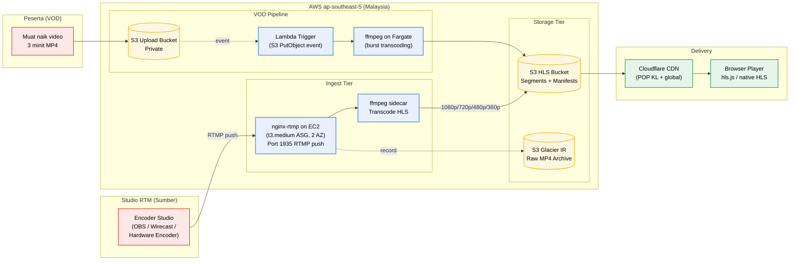

# StreamDotMy CMS

### A complete broadcast-grade competition platform — built in Malaysia, for Malaysian government broadcasters.

> **Product brochure** — submitted in fulfilment of Spesifikasi § 3.2.1 of the tender *Sebut Harga Perkhidmatan Sistem Pendaftaran Penyertaan, Saringan, Penjurian dan Pelaporan Bagi Program Realiti Junior Innovathon 2026*.
> **Edition:** Tailored for RTM Junior Innovathon 2026.
> **Version:** 1.0.

---

## Tentang StreamDotMy CMS

**StreamDotMy CMS** adalah platform pengurusan kandungan (CMS) bersepadu yang direka khas untuk **program realiti pertandingan inovasi** — menggabungkan pendaftaran penyertaan, penjurian zon, penjurian studio, penerbitan kandungan, dan **streaming langsung** dalam satu sistem yang kohesif. Berbeza daripada CMS generik yang perlu disambung dengan pelbagai third-party tools, StreamDotMy CMS menyepadukan setiap komponen yang diperlukan oleh penerbit penyiaran ke dalam satu codebase tunggal.

Direka, dibangunkan, dan diselenggara oleh **Stream.My** di Malaysia, StreamDotMy CMS dibangunkan dengan kefahaman mendalam tentang keperluan operasi penyiaran kerajaan: data residency, audit trail, integrasi multi-saluran, dan SLA tahap perkhidmatan kerajaan. Sumber kod **100% dimiliki oleh pelanggan** selepas kontrak — tiada kunci vendor (vendor lock-in), tiada bayaran lesen tahunan tersembunyi.

---

## Ciri-Ciri Utama

### 1. Streaming Server Bersepadu — Langsung + VOD

StreamDotMy CMS dilengkapi **pelayan RTMP terbina sendiri** di atas Amazon EC2, dengan keupayaan transkod **HLS multi-bitrate** automatik. Sesuai untuk:

- **Siaran langsung studio** — terima RTMP push daripada encoder studio (OBS, Wirecast, atau perkakasan), keluarkan stream HLS pelbagai resolusi (1080p, 720p, 480p, 360p) yang adaptif kepada bandwidth penonton.
- **Video-on-Demand (VOD)** — video penyertaan peserta dimuat naik ke S3 dan ditranskod secara automatik untuk playback pantas oleh juri pada mana-mana peranti.
- **Arkib mentah** — setiap ingest dirakam sebagai MP4 dan disimpan dalam S3 Glacier untuk capaian jangka panjang.

Pelayan ini berjalan dalam VPC yang sama dengan API utama — tiada data video keluar dari rangkaian peribadi pelanggan, kecuali untuk penghantaran HLS akhir kepada penonton awam (melalui CDN edge).

### 2. Kawalan Akses Pelbagai Peranan

Sistem **Role-Based Access Control (RBAC)** dengan empat peranan asas:

- **Guru** — Pendaftar pasukan sekolah; mengurus penyertaan, peserta, dan muat naik bahan
- **Juri** — Penjurian saringan zon dan penjurian studio dengan permohonan markah real-time
- **Admin / SuperAdmin** — Pengurusan keseluruhan platform, kandungan CMS, laporan, pemantauan
- **Awam** — Penonton portal awam, akses sijil dan verifikasi

Setiap peranan dilengkapi **policy-level permissions** yang boleh diubah-suai oleh SuperAdmin tanpa melibatkan developer. Audit log lengkap untuk setiap tindakan istimewa.

### 3. Senibina API-First

Frontend dan backend dipisahkan sepenuhnya — frontend ReactJS menggunakan **Laravel REST API** yang sama, membolehkan:

- Penambahan saluran (mobile native, terminal kiosk, integrasi pihak ketiga) tanpa menyentuh backend
- Versi API (`/api/v1/`, `/api/v2/`) untuk perubahan tanpa mengganggu pengguna sedia ada
- Pengujian automatik yang lebih mudah (API contract testing)
- Performance scaling — backend boleh scale berasingan daripada frontend

Memenuhi keperluan spesifikasi § 3.2.1 untuk **"Integrasi dengan backend server dalam bentuk API (pengasingan back end and front end)"**.

### 4. Web Responsif — Mesra Mudah Alih + Desktop

UI dibangunkan dengan **Bootstrap 5** dan komponen React, menyokong:

- **Desktop** — pengalaman penuh untuk SuperAdmin dan juri di pejabat
- **Tablet** — sesuai untuk juri studio dan saringan zon (orientasi mendatar/menegak)
- **Telefon pintar** — pendaftaran guru, semakan status pasukan, chatbot Awam

Setiap halaman diuji pada tiga saiz skrin sebelum dilepaskan. Tiada aplikasi mudah alih native diperlukan — pengguna terus menggunakan pelayar mudah alih mereka.

### 5. Penjurian Real-Time dengan Integrasi LED

Modul penjurian StreamDotMy CMS direka khas untuk **rakaman studio langsung**:

- Juri memasukkan markah pada tablet/telefon mereka mengikut rubrik tetap
- Markah dihantar ke API dalam masa < 500 ms
- Skrin LED studio memaparkan markah secara langsung (polling 2.5 saat, atau WebSocket untuk paparan instan)
- Pentadbir boleh "menyembunyikan" markah daripada paparan awam sehingga waktu yang ditetapkan (untuk drama persembahan)
- Agregasi markah secara automatik dengan wajaran kriteria

### 6. Statistik & Analitik

Dashboard pentadbir menyediakan visibility lengkap merentas program:

- **Pendaftaran** — jumlah pasukan, peserta mengikut sekolah, negeri, jantina, darjah/tingkatan
- **Penjurian** — taburan markah, perbezaan antara juri, perbandingan zon
- **Kandungan** — bacaan/hits/views halaman, trend pengumuman, sumber trafik
- **Chatbot** — soalan terkini, intent yang tidak dikenali, kepuasan pengguna
- **Sistem** — tempoh respons API, uptime, jumlah video disiarkan

Setiap dashboard boleh dieksport sebagai **Excel** atau **CSV** untuk pelaporan lanjut. Integrasi **Google Analytics 4** dan **CloudWatch Dashboards** untuk pandangan komprehensif.

### 7. Backup Automatik & Disaster Recovery

**Tiga tahap backup** yang berbeza:

| Sumber | Frekuensi | Penyimpanan |
|---|---|---|
| Pangkalan Data | Harian, Mingguan, Bulanan | Amazon RDS Snapshot + Cross-Region Replication |
| Aset (video, slaid) | Versioning + replikasi continuous | Amazon S3 + Cross-Region |
| Konfigurasi | Pada setiap deployment | Git + AWS Parameter Store |

**RTO** (Recovery Time Objective): < 4 jam untuk kegagalan region.
**RPO** (Recovery Point Objective): < 5 minit untuk DB; < 1 minit untuk aset.

Backup dieksport ke region kedua (`ap-southeast-1`) — pelanggan tidak pernah tersangkut dengan kegagalan satu region. Point-in-Time Recovery untuk DB membolehkan rollback ke mana-mana saat dalam tempoh 7 hari.

### 8. Chatbot AI Pintar — Web, WhatsApp, Telegram

Chatbot terintegrasi yang menjawab soalan peserta dan orang awam dalam **Bahasa Melayu dan English** secara automatik:

- Web widget — terapung di portal awam
- WhatsApp Cloud API — pelanggan menghantar mesej, sistem balas dalam < 5 saat
- Telegram Bot — pilihan untuk pelanggan yang lebih biasa dengan Telegram

Dipertingkat oleh **OpenAI GPT-4o-mini** dengan **RAG (Retrieval-Augmented Generation)** — sistem rujuk pangkalan pengetahuan pelanggan (FAQ, jadual, peraturan) sebelum menjana jawapan. Bukan "templated chatbot" yang hanya boleh menjawab soalan yang ditakrifkan dengan ketat.

---

## Senibina Pelayan Streaming

Streaming server StreamDotMy CMS direka untuk dijalankan dalam infrastruktur AWS pelanggan, dalam VPC yang sama dengan API utama. Tiada perkhidmatan streaming pihak ketiga.

**Komponen pelayan streaming:**

| Komponen | Teknologi | Rasional |
|---|---|---|
| RTMP Server | nginx + nginx-rtmp-module | Open-source, terbukti, kos rendah. Stream.My boleh customize untuk RTM. |
| Transcoder | ffmpeg | De facto standard, encode H.264/H.265 efisien |
| Compute (ingest) | EC2 t3.medium Auto Scaling Group (2 AZ) | High availability, scale-on-demand |
| Compute (VOD) | AWS Lambda + Fargate | Pay-per-use untuk transkod burst (5,000 videos) |
| Storage | Amazon S3 (Standard + Glacier IR) | Durable, encrypted at rest, lifecycle managed |
| CDN | Cloudflare (POP Kuala Lumpur) | Latency rendah, DDoS protection percuma |
| Player | hls.js (browser) + native HLS (Safari/iOS) | Open-source, no licensing fees |

**Keselamatan:**

- RTMP ingest port hanya menerima trafik daripada IP studio yang dibenarkan (security group whitelist)
- Stream key disimpan dalam AWS Secrets Manager, dirotasi setiap suku tahun
- S3 buckets enkripsi dengan AWS KMS (CMK customer-managed)
- HLS playback URL pre-signed dengan TTL pendek (10 minit) untuk konten terhad

Untuk huraian penuh senibina, rujuk dokumen `aws-architecture.md`.

---

## Galeri Modul

### Pendaftaran

Guru mendaftar pasukan sekolah melalui carian **Pangkalan Data Sekolah** (typeahead, mengikut kod sekolah / nama / negeri). Tambah peserta dengan validasi automatik (No. KP, darjah, jantina). Muat naik bahan pertandingan: **video 3-minit** (sokongan resume jika talian terputus) + **5 slaid** persembahan. Setiap pasukan menerima kod pendaftaran unik.

### Saringan 5 Zon

Senarai pasukan dibahagikan ke **5 zon geografi** (Utara, Selatan, Timur, Barat, Tengah) oleh SuperAdmin. Juri zon log masuk daripada laptop yang disediakan, atau tablet/telefon mereka sendiri. Setiap pasukan dinilai berdasarkan rubrik tetap. Status pasukan secara automatik mengikut keputusan saringan (shortlisted / not advanced).

### Penjurian Studio

6 episod rakaman, setiap satu mengandungi pasukan pilihan. Juri menggunakan UI yang disesuaikan untuk penjurian pantas (1-tap scoring per kriteria). Markah dipaparkan pada **skrin LED studio** secara langsung. Pentadbir boleh menjadual paparan markah untuk drama persembahan TV.

### Sijil Digital

Sijil PDF dijana secara automatik untuk:
- Peserta (sijil penyertaan)
- Finalists (sijil finalis)
- Pemenang (sijil pemenang)
- Juri (sijil penghargaan juri)
- Guru pengiring (sijil penghargaan guru)

Setiap sijil mempunyai **kod verifikasi unik** dan QR code — boleh disahkan di portal awam (`/sijil/verify/{kod}`) untuk anti-pemalsuan.

### Helpdesk

Pengguna boleh menghantar tiket sokongan melalui portal atau emel. Setiap tiket dikategorikan mengikut SLA:

| Severity | Isu | Tindak balas |
|---|---|---|
| Kritikal | Sistem down, tidak boleh log masuk | **SEGERA** |
| Sederhana | Fungsi error / tidak berfungsi | **3 jam** |
| Ringan | Typo, susunan kandungan salah | **24 jam** |

Helpdesk operator menerima notifikasi WhatsApp/emel automatik untuk tiket kritikal. Pelaporan SLA bulanan dijana secara automatik.

---

## Matriks Peranan & Kebenaran

| Modul / Tindakan | Guru | Juri | Admin | Awam |
|---|:---:|:---:|:---:|:---:|
| Mendaftar pasukan | ✓ | — | ✓ | — |
| Muat naik video penyertaan | ✓ | — | ✓ | — |
| Tonton video pasukan sendiri | ✓ | — | ✓ | — |
| Tonton video pasukan lain (saringan) | — | ✓ | ✓ | — |
| Beri markah saringan | — | ✓ | — | — |
| Beri markah studio | — | ✓ | — | — |
| Lihat semua markah | — | ✓ (sendiri) | ✓ | — |
| Lihat dashboard analitik | — | — | ✓ | — |
| Mengurus kandungan CMS | — | — | ✓ | — |
| Mengurus pengguna | — | — | ✓ (SuperAdmin) | — |
| Lihat portal awam | ✓ | ✓ | ✓ | ✓ |
| Verifikasi sijil | ✓ | ✓ | ✓ | ✓ |
| Chatbot | ✓ | ✓ | ✓ | ✓ |
| Eksport laporan | — | — | ✓ | — |

Kebenaran berasaskan **Spatie Laravel Permission** — boleh dikemas kini oleh SuperAdmin tanpa perubahan kod.

---

## Statistik & Analitik

StreamDotMy CMS menyediakan **dashboard tiga lapisan**:

**Lapisan 1 — Statistik Program** (untuk Penerbit RTM)
- Jumlah pendaftaran (real-time)
- Pendaftaran mengikut hari/jam (trend)
- Sekolah teratas mengikut bilangan pasukan
- Demografi peserta (jantina, darjah, negeri)
- Kategori inovasi
- Status muat naik video (siap / dalam proses / gagal)

**Lapisan 2 — Statistik Penjurian** (untuk Pentadbir & Penerbit)
- Taburan markah saringan
- Perbezaan markah antara juri (mengesan bias)
- Markah purata mengikut zon
- Markah studio mengikut episod
- Senarai finalists secara automatik

**Lapisan 3 — Statistik Sistem** (untuk Pentadbir Teknikal)
- Tempoh respons API (p50/p95/p99)
- Penggunaan kuota (storage, transcoding, bandwidth)
- Uptime mengikut perkhidmatan
- Trafik chatbot dan kadar kepuasan

Semua data boleh dieksport sebagai **Excel** atau **CSV**. Visualisasi menggunakan **Recharts** dengan tema yang konsisten.

---

## Backup & Pemulihan

StreamDotMy CMS mengikuti prinsip **3-2-1**: 3 salinan data, 2 jenis storan berbeza, 1 salinan offsite.

**Pelan backup automatik:**

| Sumber | Frekuensi | Retensi | Lokasi |
|---|---|---|---|
| RDS MySQL snapshot | Harian (02:00 MYT) | 7 hari | `ap-southeast-5` |
| RDS MySQL snapshot | Mingguan (Ahad) | 12 minggu | `ap-southeast-5` + `ap-southeast-1` |
| RDS MySQL snapshot | Bulanan (1hb) | 12 bulan | `ap-southeast-5` + `ap-southeast-1` |
| S3 uploads (video, slaid) | Continuous replication | (kekal) | `ap-southeast-5` + `ap-southeast-1` |
| Konfigurasi (Terraform state) | Pada setiap perubahan | Git history | GitHub + S3 Backend |

**Pengujian backup:**

Setiap suku tahun, satu set backup dipulihkan ke environment ujian untuk memastikan integriti dan mengukur tempoh pemulihan sebenar. Laporan disediakan kepada pelanggan.

**Sasaran pemulihan:**

- **Kegagalan ECS task**: < 30 saat (auto-restart)
- **Kegagalan AZ tunggal**: < 2 minit (RDS Multi-AZ failover)
- **Kegagalan region penuh**: < 4 jam (manual failover ke `ap-southeast-1`)
- **Pemulihan DB ke titik-tertentu**: < 1 jam
- **Pemulihan objek S3 (terpadam tidak sengaja)**: < 5 minit (versioning)

---

## Keselamatan

StreamDotMy CMS dibangunkan dengan prinsip **"secure-by-default"** mengikuti **AWS Well-Architected Framework (Security Pillar)** dan **OWASP Top 10**.

**Enkripsi:**

- Data **at rest**: AWS KMS dengan customer-managed CMK untuk RDS, ElastiCache, S3, EBS
- Data **in transit**: TLS 1.2+ enforced; Cloudflare → ALB dengan mTLS (Authenticated Origin Pulls)
- Backups dienkripsi dengan kunci KMS berasingan

**Kawalan capaian:**

- Pengguna sistem — Laravel Sanctum cookie auth, MFA opsional
- Pentadbir AWS — IAM Identity Center dengan MFA wajib, session melalui Systems Manager (tidak ada SSH bastion)
- Tiada IAM access key jangka panjang dalam codebase atau CI/CD (OIDC trust dengan GitHub Actions)

**Pengesanan ancaman:**

- **Amazon GuardDuty** — 24/7 anomaly detection (memenuhi spec § 3.8.1(g))
- **AWS Security Hub** — CIS AWS Foundations Benchmark, PCI-DSS rules
- **AWS WAF** + **Cloudflare WAF** — perlindungan dua lapisan dari SQL injection, XSS, RCE
- **AWS Shield Standard** + **Cloudflare DDoS** — perlindungan DDoS dua lapisan

**Audit:**

- **AWS CloudTrail** — log setiap API call ke akaun AWS (memenuhi spec § 2.1.7)
- **VPC Flow Logs** — log trafik rangkaian untuk forensik
- **Application audit log** — `spatie/laravel-activitylog` log setiap perubahan data sensitif

**Pematuhan:**

- OWASP ASVS Level 2
- AWS Well-Architected Security Pillar
- Akta Perlindungan Data Peribadi 2010 (PDPA Malaysia)
- Garis panduan keselamatan ICT MAMPU
- ISO 27001 ready (Stream.My memohon sijil ISO 27001 dalam progres)

---

## Mengapa CMS Dibangunkan Tempatan

**§ 3.2.1 Spesifikasi** secara eksplisit menyatakan: *"CMS dibangunkan secara: a) Product tempatan / menggunakan local developer."*

StreamDotMy CMS memenuhi keperluan ini secara mutlak:

| Aspek | StreamDotMy CMS | CMS Off-the-Shelf (Wordpress, Drupal) |
|---|---|---|
| Pembangun | Stream.My (Malaysia) | Komuniti global / Vendor luar negara |
| Source code | Penuh diserah ke RTM | Open-source tapi tidak diubah-suai oleh vendor |
| Customization | Tanpa had — kami tulis kod | Terikat plugin third-party |
| Bahasa sokongan | BM + English (oleh pasukan tempatan) | Inggeris sahaja, atau forum komuniti |
| Lokasi data | `ap-southeast-5` (KL) | Bergantung kepada hosting pelanggan |
| Pematuhan PDPA | Direka untuk PDPA Malaysia | Generik |
| Sokongan SLA | Stream.My on-call 24/7 | Vendor luar negara / komuniti |
| Hak milik | RTM (§ 3.14.1) | Vendor / komuniti |

**Penyerahan hak milik** (§ 3.14.1): pada akhir kontrak, RTM menerima:
- Source code penuh (frontend, backend, infrastructure)
- Akses pentadbir penuh ke AWS account
- Akses pentadbir penuh ke Cloudflare account
- Semua kunci KMS, sijil, lesen, langganan
- Manual pentadbir + manual teknikal (2 hardcopy + softcopy)
- Sesi handover berdokumen

**Pembangunan dalam negara** (§ 3.12.7): semua kerja pembangunan, ujian, dan penyelenggaraan dijalankan oleh kakitangan Stream.My di Malaysia. Tiada outsource ke luar negara.

**Akta Rahsia Rasmi** (§ 2.1.7): semua kakitangan menjalani E-Vetting CGSO sebelum mendapat capaian. Data peserta sekolah dan markah penjurian disimpan dalam region AWS Malaysia — tidak meninggalkan negara.

---

## Spesifikasi Teknikal Ringkas

| Aspek | Spesifikasi |
|---|---|
| **Frontend** | ReactJS 18 + TypeScript + Vite + Bootstrap 5 |
| **Backend** | Laravel (latest LTS), PHP 8.3+, REST API |
| **Database** | Amazon RDS for MySQL 8 Multi-AZ |
| **Cache & queue** | Amazon ElastiCache for Redis Multi-AZ |
| **Object storage** | Amazon S3 (Standard + Glacier IR) |
| **Streaming server** | nginx-rtmp + ffmpeg on EC2 (Multi-AZ ASG) |
| **VOD pipeline** | AWS Lambda + Fargate transcoding |
| **CDN & Edge** | Cloudflare Business (POP KL) |
| **Region hosting** | AWS Asia Pacific (Malaysia) — `ap-southeast-5` |
| **Identiti & peranan** | Laravel Sanctum + Spatie Permission |
| **AI chatbot** | OpenAI GPT-4o-mini (RAG) |
| **Pemantauan** | Amazon CloudWatch + X-Ray + GuardDuty |
| **Backup** | AWS Backup (DB) + S3 Cross-Region Replication (assets) |
| **CI/CD** | GitHub Actions → ECR → ECS (OIDC trust) |
| **IaC** | Terraform modules (sumber kod terbuka kepada pelanggan) |
| **Sokongan pelayar** | Chrome, Firefox, Safari, Edge — versi terkini |
| **Sokongan peranti** | Desktop, tablet, telefon pintar (web responsif) |
| **Skala pengguna** | 5,000 pengguna serentak (auto-scale) |
| **Uptime SLA** | 99.5% (target operasi); 99.9% (target studio recording window) |
| **Tempoh respons API** | p95 < 500ms, p99 < 1000ms |

---

## Maklumat Syarikat

**Stream.My Sdn. Bhd.**

Pembangun perisian dan integrator sistem yang berpangkalan di Malaysia, berkhidmat kepada sektor penyiaran, pendidikan, dan kerajaan.

| | |
|---|---|
| **Emel** | sales@stream.my |
| **Kod Bidang KK** | 210103, 210104, 210108 |
| **Pengkhususan** | Sistem CMS, integrasi penyiaran, platform pertandingan, streaming |
| **Pengalaman** | 5-10 tahun dalam pembangunan sistem pendaftaran, penjurian, dan pertandingan dalam talian (rujuk Lampiran Pengalaman dalam Technical Proposal) |
| **Pasukan teknikal** | Pembangun penuh masa di Malaysia, semua telah/sedia menjalani E-Vetting CGSO |
| **Tahap sokongan** | 24/7 helpdesk untuk tempoh kontrak |

---

## Rujukan Dokumen Berkaitan

- [`aws-architecture.md`](./aws-architecture.md) — senibina AWS terperinci, network topology, security model
- [`diagram-sistem.md`](./diagram-sistem.md) — rajah senibina sistem (Lampiran 1 + versi AWS)
- [`jadual-perkhidmatan.md`](./jadual-perkhidmatan.md) — pengisytiharan komponen perisian
- [`jadual-pelaksanaan.md`](./jadual-pelaksanaan.md) — pelan pelaksanaan 90-hari pembekal
- [`gantt-chart-rtm.md`](./gantt-chart-rtm.md) — reproduksi carta Gantt RTM

---

*StreamDotMy CMS™ adalah produk Stream.My Sdn. Bhd. Direka, dibangunkan, dan diselenggara di Malaysia.*
