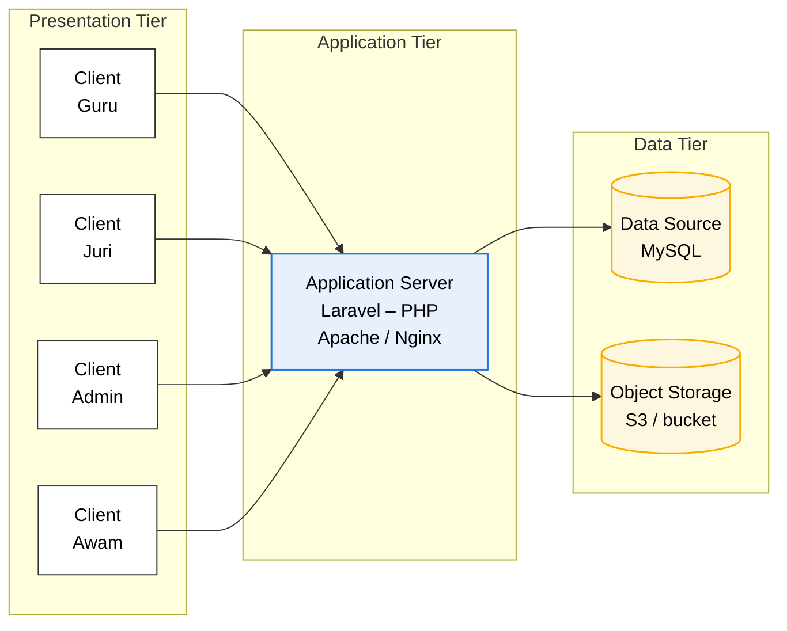
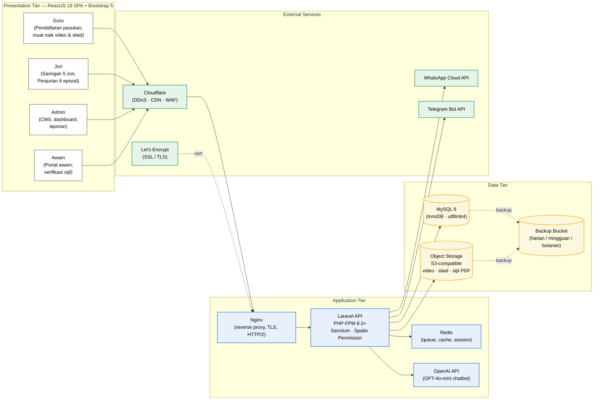

# Diagram Sistem — Draft

> **Status:** Draft v1.
> **Source reference:** `docs/Technical Proposal/Lampiran_1.pdf`
> **Purpose:** Senibina 3-tier untuk Sistem Pendaftaran Penyertaan, Saringan, Penjurian dan Pelaporan Program Realiti Junior Innovathon 2026, selaras dengan Lampiran 1 dokumen sebut harga.

---

## Reproduksi Lampiran 1 (3-tier asas)



Catatan: *Aplikasi server hendaklah menggunakan versi yang TERKINI* (per Lampiran 1).

---

## Versi diperinci (mengikut tumpukan dipilih)

Sama seperti rajah asal, tetapi memetakan teknologi konkrit yang dicadangkan dalam Jadual Perkhidmatan.



---

## Komponen utama

| Lapisan | Komponen | Teknologi |
|---|---|---|
| Presentation | SPA frontend | ReactJS 18 + TypeScript + Vite + Bootstrap 5 |
| Presentation | Routing & state | React Router v6, TanStack Query, React Hook Form |
| Application | Web server | Nginx (reverse proxy, HTTP/2, gzip/brotli) |
| Application | API server | Laravel (latest) on PHP-FPM 8.3+ |
| Application | Auth | Laravel Sanctum (SPA cookie session) |
| Application | Roles | Spatie laravel-permission (Guru, Juri, Admin, Awam) |
| Application | Queue & cache | Redis |
| Application | AI chatbot | OpenAI GPT-4o-mini + text-embedding-3-small (RAG) |
| Data | Relational DB | MySQL 8 (InnoDB, utf8mb4_unicode_ci) |
| Data | Object storage | S3-compatible (video, slaid, sijil PDF) |
| Data | Backup | Pail S3 berasingan, retensi harian/mingguan/bulanan |
| External | DDoS + CDN + WAF | Cloudflare |
| External | SSL/TLS | Let's Encrypt (auto-renew 90 hari) |
| External | Messaging | WhatsApp Cloud API, Telegram Bot API |

---

## Cara eksport untuk dokumen proposal

Rajah Mermaid di atas dirender secara automatik pada GitHub (boleh dilihat dengan membuka fail ini di github.com). Untuk eksport ke PNG / SVG / PDF untuk dilampirkan dalam dokumen proposal:

**Pilihan A — Mermaid Live Editor (paling cepat)**
1. Buka https://mermaid.live
2. Salin kod blok Mermaid di atas (mulakan dari `flowchart LR`)
3. Tampal pada panel kiri
4. Klik **Actions → PNG** atau **SVG**

**Pilihan B — Mermaid CLI (untuk batch / automated)**
```bash
npm install -g @mermaid-js/mermaid-cli
mmdc -i diagram-sistem.mmd -o diagram-sistem.png -w 1600 -H 1000
```

**Pilihan C — VS Code extension**
Pasang *Mermaid Chart* extension, buka fail `.md` ini, klik kanan rajah → **Export as PNG**.

---

## Versi alternatif (jika diperlukan format draw.io)

Jika RTM atau JKR meminta format editable (`.drawio` / `.vsdx`), rajah ini boleh dieksport ke `app.diagrams.net`:
1. Buka https://app.diagrams.net
2. **Arrange → Insert → Advanced → Mermaid**
3. Tampal kod Mermaid → **Insert**
4. Save sebagai `.drawio` atau Export sebagai `.png` / `.pdf` / `.vsdx`.
