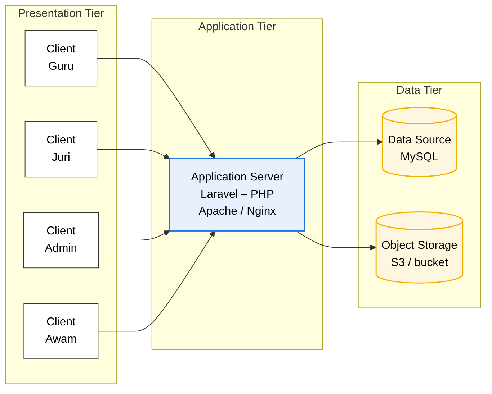
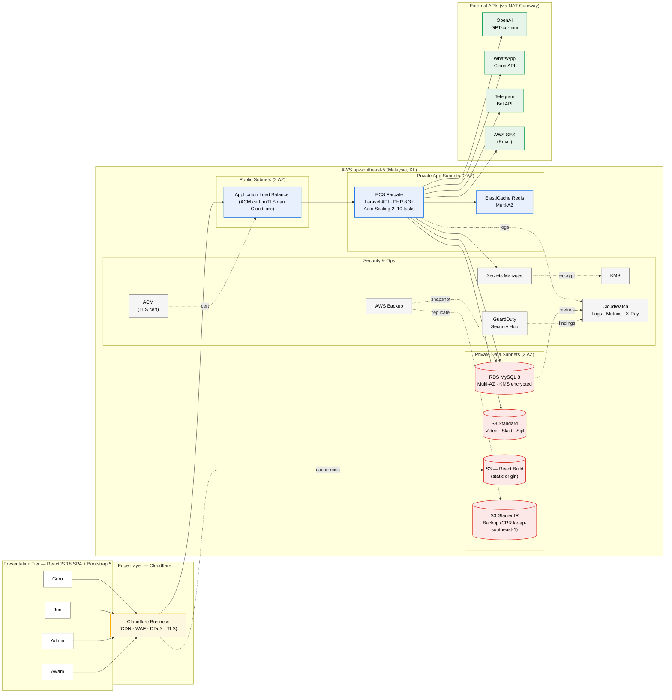

# Diagram Sistem — Draft

> **Status:** Draft v1.
> **Source reference:** `docs/Technical Proposal/Lampiran_1.pdf`
> **Purpose:** Senibina 3-tier untuk Sistem Pendaftaran Penyertaan, Saringan, Penjurian dan Pelaporan Program Realiti Junior Innovathon 2026, selaras dengan Lampiran 1 dokumen sebut harga.

---

## Reproduksi Lampiran 1 (3-tier asas)



Catatan: *Aplikasi server hendaklah menggunakan versi yang TERKINI* (per Lampiran 1).

---

## Versi diperinci — Penempatan di AWS (ap-southeast-5, KL)

Memetakan senibina 3-tier ke perkhidmatan AWS konkrit di Region Malaysia, dengan Cloudflare sebagai edge layer di hadapan. Untuk huraian penuh, rujuk [`aws-architecture.md`](./aws-architecture.md).



---

## Komponen utama (AWS-aligned)

| Lapisan | Komponen | Teknologi / Perkhidmatan AWS |
|---|---|---|
| Edge | CDN + WAF + DDoS | **Cloudflare Business** (POP KL) |
| Edge | TLS termination | Cloudflare Full (Strict) + ACM origin cert |
| Presentation | SPA frontend | ReactJS 18 + TypeScript + Vite + Bootstrap 5 |
| Presentation | Hosting frontend | **S3 Standard** (static) — origin untuk Cloudflare |
| Presentation | Routing & state | React Router v6, TanStack Query, React Hook Form |
| Application | Load balancer | **Application Load Balancer (ALB)** Multi-AZ |
| Application | API runtime | **ECS Fargate** (Laravel + PHP-FPM 8.3+) Multi-AZ, auto-scale |
| Application | Container registry | **ECR** (private) |
| Application | Auth | Laravel Sanctum (SPA cookie session) |
| Application | Roles | Spatie laravel-permission (Guru, Juri, Admin, Awam) |
| Application | Queue & cache | **ElastiCache for Redis** Multi-AZ |
| Application | AI chatbot | OpenAI GPT-4o-mini + text-embedding-3-small (RAG) |
| Data | Relational DB | **Amazon RDS for MySQL 8** Multi-AZ (Primary + Standby, KMS encrypted) |
| Data | Object storage | **Amazon S3 Standard** (video, slaid, sijil PDF) — KL region |
| Data | Backup | **AWS Backup** + S3 Glacier IR + cross-region replication ke `ap-southeast-1` |
| Security | TLS certificate | **AWS Certificate Manager (ACM)** — auto-renew |
| Security | Secrets | **AWS Secrets Manager** (DB password, API keys) |
| Security | Encryption keys | **AWS KMS** (CMK customer-managed) |
| Security | Threat detection | **GuardDuty** 24/7 + **Security Hub** |
| Security | Audit | **CloudTrail** (multi-region) + **VPC Flow Logs** |
| Observability | Logs + metrics | **CloudWatch Logs + Metrics + Alarms** |
| Observability | Tracing | **AWS X-Ray** |
| Network | VPC | 2 AZ, public + private subnets, NAT × 2 |
| Network | DNS | **Route 53** (authoritative; delegated ke Cloudflare proxy) |
| Network | Egress optimization | **VPC Endpoints** untuk S3 + Secrets Manager + ECR |
| Email | Transactional | **AWS SES** |
| External | Messaging | WhatsApp Cloud API, Telegram Bot API |
| CI/CD | Pipeline | GitHub Actions → ECR → ECS (OIDC trust, no long-lived keys) |

---

## Cara eksport untuk dokumen proposal

Rajah Mermaid di atas dirender secara automatik pada GitHub (boleh dilihat dengan membuka fail ini di github.com). Untuk eksport ke PNG / SVG / PDF untuk dilampirkan dalam dokumen proposal:

**Pilihan A — Mermaid Live Editor (paling cepat)**
1. Buka https://mermaid.live
2. Salin kod blok Mermaid di atas (mulakan dari `flowchart LR`)
3. Tampal pada panel kiri
4. Klik **Actions → PNG** atau **SVG**

**Pilihan B — Mermaid CLI (untuk batch / automated)**
```bash
npm install -g @mermaid-js/mermaid-cli
mmdc -i diagram-sistem.mmd -o diagram-sistem.png -w 1600 -H 1000
```

**Pilihan C — VS Code extension**
Pasang *Mermaid Chart* extension, buka fail `.md` ini, klik kanan rajah → **Export as PNG**.

---

## Versi alternatif (jika diperlukan format draw.io)

Jika RTM atau JKR meminta format editable (`.drawio` / `.vsdx`), rajah ini boleh dieksport ke `app.diagrams.net`:
1. Buka https://app.diagrams.net
2. **Arrange → Insert → Advanced → Mermaid**
3. Tampal kod Mermaid → **Insert**
4. Save sebagai `.drawio` atau Export sebagai `.png` / `.pdf` / `.vsdx`.
