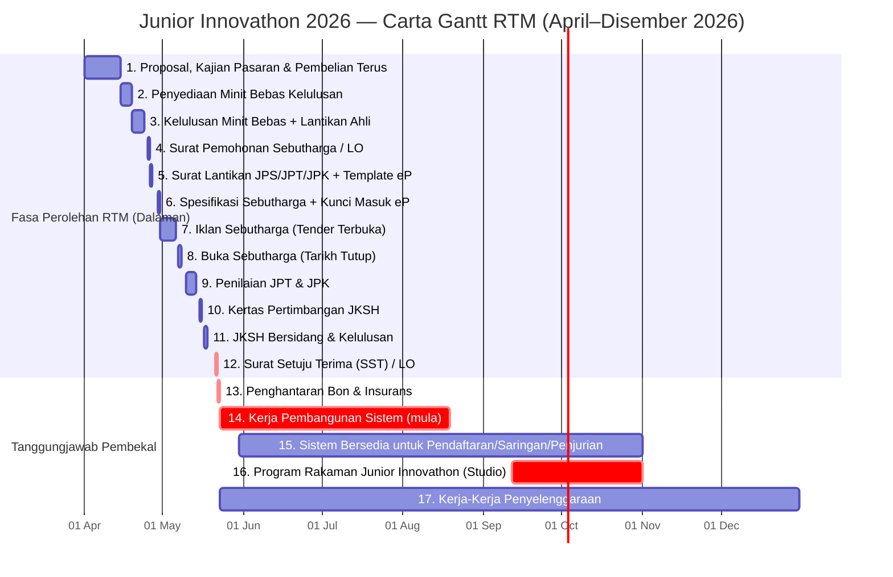

# Carta Gantt Rasmi RTM — Junior Innovathon 2026

> **Status:** Draft v1 — reproduksi rajah rasmi.
> **Sumber asal:** `docs/Technical Proposal/SISTEM_DATA_-_GANTT_CHART_JR_INNOVATHON_2026.pdf`
> **Tujuan:** Pemahaman menyeluruh timeline perolehan dan pelaksanaan yang ditetapkan RTM, dari fasa kajian pasaran (April 2026) sehingga penyelenggaraan akhir kontrak (Disember 2026).

Dokumen ini adalah **reproduksi** carta Gantt rasmi yang dikeluarkan oleh Jabatan Penyiaran Malaysia (RTM) dalam dokumen sebut harga. Ia dibahagikan kepada dua kategori jelas:

- **Fasa Perolehan RTM (Item 1–12)** — proses dalaman RTM, pembekal tidak terlibat secara langsung.
- **Tanggungjawab Pembekal (Item 13–17)** — bermula daripada penyerahan Bon/Insurans selepas SST.

---

## Carta Gantt (Mermaid)

---

## Jadual Ringkas

| Bil | Aktiviti | Tarikh | Pihak Bertanggungjawab |
|---|---|---|---|
| 1 | Proposal, Kajian Pasaran Sebutharga & Pembelian Terus | Awal April 2026 | RTM (dalaman) |
| 2 | Penyediaan Minit Bebas Kelulusan Memulakan Perolehan | Pertengahan April 2026 | RTM (dalaman) |
| 3 | Kelulusan Minit Bebas + Surat Lantikan Ahli Mesyuarat | 19 – 24 Apr 2026 | RTM (dalaman) |
| 4 | Penyediaan Surat Pemohonan Sebutharga / Pesanan Kerajaan | 25 Apr 2026 | RTM (dalaman) |
| 5 | Surat Lantikan JPS, JPT & JPK + Penyediaan Template eP | 26 Apr 2026 | RTM (dalaman) |
| 6 | Penyediaan Spesifikasi Sebutharga + Kunci Masuk eP | 29 Apr 2026 | RTM (dalaman) |
| 7 | **Iklan Sebutharga (Tender Terbuka)** | 30 Apr – 6 Mei 2026 | RTM → Pembekal layak boleh mendaftar |
| 8 | **Buka Sebutharga (Tarikh Tutup Tender)** | 7 – 8 Mei 2026 | Pembekal serah dokumen |
| 9 | Penilaian JPT & JPK | 10 & 14 Mei 2026 | RTM (dalaman) |
| 10 | Penyediaan Kertas Pertimbangan JKSH | 15 Mei 2026 | RTM (dalaman) |
| 11 | JKSH Bersidang & Kelulusan Dikeluarkan | 17 Mei 2026 | RTM (dalaman) |
| 12 | **Surat Setuju Terima (SST) / Pesanan Kerajaan dikeluarkan** | **21 Mei 2026** | RTM → Pembekal terpilih |
| 13 | **Penghantaran Bon Pelaksanaan / Insurans** | 22 Mei 2026 | **Pembekal** |
| 14 | **Kerja-Kerja Pembangunan Sistem Data** | Mula 23 Mei 2026 | **Pembekal** |
| 15 | Sistem Bersedia untuk Data Penyertaan, Saringan dan Penjurian | 30 Mei – 1 Nov 2026 | **Pembekal** |
| 16 | Program Rakaman Junior Innovathon Berlangsung (Studio) | 12 Sep – 1 Nov 2026 | **Pembekal** + RTM Penerbitan |
| 17 | Kerja-Kerja Penyelenggaraan | Mei – Disember 2026 | **Pembekal** |

---

## Tarikh Kritikal untuk Pembekal

| Tarikh | Peristiwa | Catatan |
|---|---|---|
| 30 Apr – 6 Mei 2026 | Tempoh iklan tender | Pembekal terbuka untuk bid melalui ePerolehan |
| 7 – 8 Mei 2026 | Tarikh tutup tender | Semua dokumen mesti dimuat naik sebelum tarikh ini |
| **21 Mei 2026** | **SST dikeluarkan** | Pemenang dimaklumkan; kontrak bermula |
| **22 Mei 2026** | Penghantaran Bon + Insurans | Performance Bond + Workmen's Comp + Public Liability — mesti standby awal |
| **23 Mei 2026** | Mula pembangunan sistem | Hari ke-1 dari **tempoh 90 hari** (§ 2.1.20) |
| **30 Mei 2026** | Sistem pendaftaran live | Modul Pendaftaran mesti boleh terima penyertaan (cuma 7 hari dari mula!) |
| **19 Ogos 2026** | Hari ke-90 dari SST | Sistem WAJIB siap berperingkat (§ 2.1.20) |
| **12 Sep 2026** | Mula rakaman studio | 6 episod — pembekal on-site untuk live scoring + LED |
| **1 Nov 2026** | Tamat program rakaman | Kemuncak teknikal selesai |
| **Dis 2026** | Tamat kontrak | Penyelenggaraan berterusan + handover |

---

## Pemerhatian Strategik

1. **Tempoh persiapan pasca-SST sangat singkat** — hanya 1 hari antara SST (21 Mei) dan bond submission (22 Mei). Bon Pelaksanaan + Insurans WAJIB disiapkan **sebelum** SST dikeluarkan untuk elak kelewatan.

2. **Item 15 ("Sistem bersedia 30 Mei")** — hanya 7 hari selepas mula development. Tafsiran realistik: **modul Pendaftaran sahaja** yang perlu live pada 30 Mei; modul Saringan/Penjurian/CMS akan menyusul mengikut fasa. Internal execution plan (`jadual-pelaksanaan.md`) memperincikan susunan tersebut.

3. **Tempoh "Sistem Bersedia" 30 Mei – 1 Nov** (~5 bulan) — ini adalah tempoh **operasi sistem secara live**, bukan pembangunan. Sistem mesti stabil sepanjang tempoh ini. Sebarang downtime akan menjejaskan pendaftaran sekolah.

4. **Studio recording (12 Sep – 1 Nov, ~7 minggu)** — kemuncak risiko teknikal: live scoring oleh juri di studio, paparan markah ke LED screen, real-time data antara sistem dan pengeluaran. Pembekal mesti hadir secara fizikal (§ 3.9.2, § 3.8.1(h)).

5. **Penyelenggaraan paralel** (Item 17) — bermula dari hari pertama pembangunan dan berterusan hingga akhir kontrak. Bermakna pasukan support mesti standby walaupun masih dalam fasa pembinaan.

---

## Cara Eksport untuk Dokumen Proposal

Carta Gantt Mermaid di atas dirender secara automatik pada GitHub. Untuk eksport ke PNG / SVG / PDF bagi lampiran proposal, ikut langkah yang sama seperti `diagram-sistem.md`:

- **Mermaid Live Editor** — https://mermaid.live → tampal kod → Actions → PNG/SVG.
- **Mermaid CLI** — `mmdc -i gantt-chart-rtm.mmd -o gantt-chart-rtm.png -w 1800 -H 1200`.
- **VS Code Mermaid Chart extension** — buka fail, klik kanan rajah → Export as PNG.

---

## Pelan Pelaksanaan Dalaman Pembekal

Untuk pecahan terperinci Item 13–17 (tanggungjawab pembekal) kepada milestone teknikal mingguan, sila rujuk **[jadual-pelaksanaan.md](./jadual-pelaksanaan.md)**.
