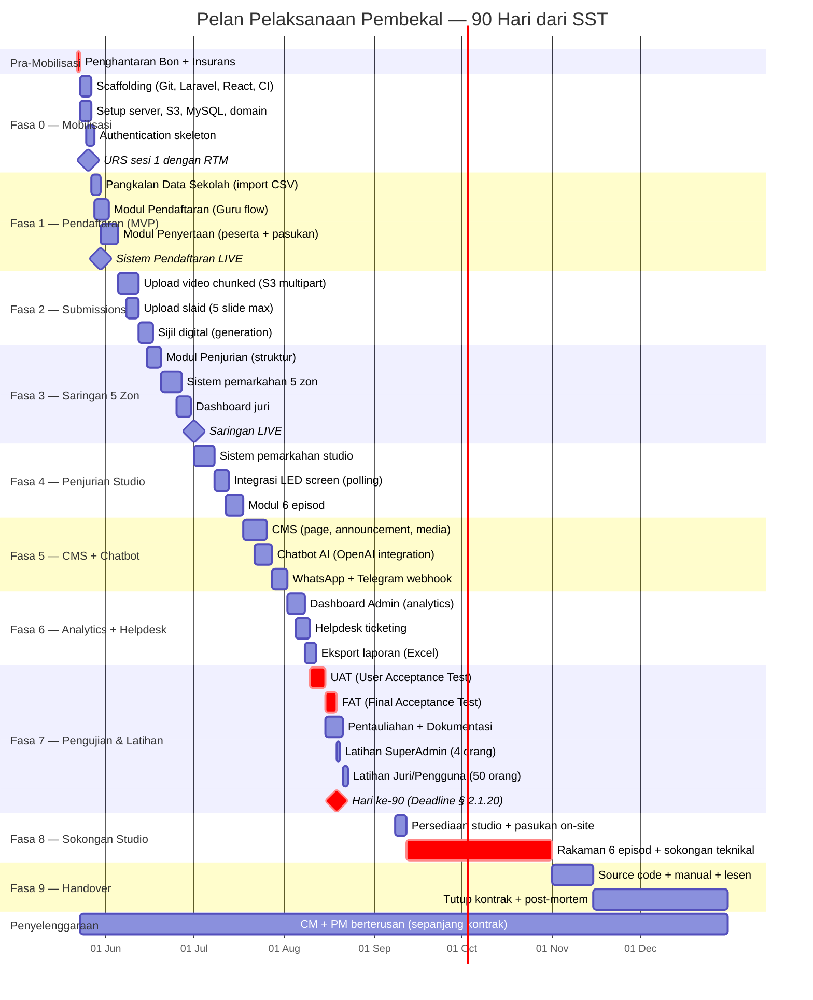

# Jadual Pelaksanaan Pembekal — Junior Innovathon 2026

> **Status:** Draft v1 — pelan pelaksanaan dalaman.
> **Skop:** Memperincikan tanggungjawab pembekal (Item 13–17 dalam carta Gantt RTM) kepada milestone teknikal mingguan.
> **Rujukan utama:** § 2.1.20 (tempoh 90 hari berperingkat), § 2.1.22 (Carta Gantt wajib), § 3.9 (latihan), § 3.10 (manual & dokumentasi), § 3.11 (penyelenggaraan & waranti), § 3.13 (UAT & FAT), § 3.14 (handover).
> **Pelan terkait:** [gantt-chart-rtm.md](./gantt-chart-rtm.md) — carta Gantt rasmi RTM dan tarikh anchor.

---

## Ringkasan

Pelan ini memenuhi keperluan **§ 2.1.20** — penyiapan sistem dalam tempoh **90 hari secara berperingkat** dari tarikh Surat Setuju Terima (SST):

- **SST dikeluarkan:** 21 Mei 2026
- **Hari ke-1 development:** 23 Mei 2026
- **Hari ke-90 (deadline berperingkat):** 19 Ogos 2026
- **Studio recording bermula:** 12 September 2026 (semua modul WAJIB siap sebelum tarikh ini)
- **Tamat kontrak:** Disember 2026

---

## Fasa Pra-SST (April – 20 Mei 2026)

Walaupun secara rasmi pembangunan hanya bermula 23 Mei, pembekal yang serius akan menjalankan **persiapan paralel** semasa fasa perolehan dalaman RTM. Ini bukan kerja berbayar — ini investasi untuk memastikan kita boleh "hit the ground running" pada hari ke-1.

| Aktiviti | Status | Catatan |
|---|---|---|
| Analisis spesifikasi & jadual pematuhan | ✅ Sedang dibuat | Telah selesai fasa pemahaman |
| Cadangan reka bentuk sistem (Lampiran 1) | ✅ Selesai | Lihat `diagram-sistem.md` |
| Cadangan komponen perisian (Jadual Perkhidmatan) | ✅ Selesai | Lihat `jadual-perkhidmatan.md` |
| Senibina API dan skema pangkalan data | 🔄 Dalam perancangan | Draft awal untuk URS |
| Scaffolding repository (greenfield) | ✅ Selesai | Lihat `README.md`, `CLAUDE.md` |
| Penyediaan template URS untuk sesi awal RTM | ⏳ Akan datang | Sebelum SST |
| Pemilihan vendor S3, domain pendaftaran, sijil SSL | ⏳ Akan datang | Standby untuk diaktifkan pasca-SST |
| Permohonan E-Vetting CGSO untuk pasukan teknikal | ⏳ Akan datang | Tempoh pemprosesan ~2-4 minggu — mesti mula sebelum SST |
| Standby Bon Pelaksanaan + Insurans | ⏳ Akan datang | Wajib siap untuk serahan 22 Mei |

---

## Pelan Pelaksanaan 90 Hari (Mermaid)

---

## Pecahan Fasa Terperinci

### Fasa 0 — Mobilisasi (23–29 Mei 2026, 7 hari)

**Objektif:** Sistem asas berdiri, pasukan boleh mula coding modul Pendaftaran.

| Tugas | Output | Spec § |
|---|---|---|
| Repo Git aktif dengan struktur `backend/` + `frontend/` | Repo bersedia untuk multi-developer | 2.1.22 |
| Laravel 11 + Sanctum + Spatie Permission terpasang | API root response 200, login skeleton | 3.2.1 |
| React 18 + Bootstrap 5 + Vite terpasang | SPA build clean, kosong tapi boleh hit API | 3.1.3, 3.2.2 |
| Server staging aktif (Nginx + PHP-FPM + MySQL + Redis + S3) | URL staging boleh diakses | 3.5.1 |
| Domain pre-prod aktif (sub.juniorinnovathon.rtm.gov.my) | DNS + SSL aktif | 3.8.1(f) |
| URS sesi 1 dengan RTM (refine spesifikasi) | Minit URS disahkan dalam 5 hari (§ 2.1.16) | 2.1.16 |

**Deliverable:** Demo "Hello World" — pendaftar guru boleh log in, lihat dashboard kosong.

---

### Fasa 1 — Pendaftaran MVP (27 Mei – 4 Jun 2026)

**Objektif:** Memenuhi Item 15 RTM Gantt — "Sistem bersedia untuk data penyertaan" pada **30 Mei 2026**.

| Tugas | Spec § |
|---|---|
| Import Pangkalan Data Sekolah (CSV → MySQL) | 3.2.5(a) |
| Carian sekolah (typeahead) | 3.2.5(a) |
| Pendaftaran guru sebagai pengiring pasukan | 3.2.5 |
| CRUD pasukan (team) | 3.2.5 |
| CRUD peserta dalam pasukan | 3.2.5 |
| Status workflow pasukan (draft → submitted) | 3.2.5 |
| Email pengesahan + login flow | 3.2 |

**Deliverable:** **Sistem pendaftaran live pada 30 Mei 2026** — sekolah boleh mula mendaftar. Memenuhi Item 15 carta Gantt RTM.

---

### Fasa 2 — Submissions (5–14 Jun 2026)

**Objektif:** Pasukan boleh muat naik bahan penyertaan.

| Tugas | Spec § |
|---|---|
| Pre-signed S3 multipart upload (video 3 minit, ~500MB) | 3.2.5 |
| Muat naik slaid (max 5) | 3.2.5 |
| Validasi durasi video (ffprobe) | 3.2.5 |
| Pre-signed download URL untuk juri | 3.6.1 |
| Sijil penyertaan digital — generation per pendaftar | 3.2.5(c) |

**Deliverable:** End-to-end submission flow — guru daftar → upload video + slaid → terima sijil PDF.

---

### Fasa 3 — Saringan 5 Zon (15 Jun – 1 Jul 2026)

**Objektif:** Modul saringan zon aktif untuk juri.

| Tugas | Spec § |
|---|---|
| Skema kriteria penilaian (configurable) | 3.6.2 |
| Pembahagian juri ke zon (5 zon: Utara, Selatan, Timur, Barat, Tengah) | 3.6.1 |
| UI penjurian zon (mobile + tablet + desktop) | 3.6.1 |
| Borang pemarkahan dengan validasi | 3.6.1 |
| Audit log setiap pemarkahan | 3.12 |
| 5 unit komputer riba untuk juri (sewa) | 3.6.1 |
| Laporan saringan (lulus/gagal/shortlist) | 3.6.3 |

**Deliverable:** Juri zon boleh log in dari laptop/tablet/phone, lihat senarai pasukan zon mereka, dan beri markah.

---

### Fasa 4 — Penjurian Studio + LED Display (1–18 Jul 2026)

**Objektif:** Sistem pemarkahan studio dengan paparan LED real-time.

| Tugas | Spec § |
|---|---|
| Skema episod (6 episod) + jadual rakaman | 3.6.4 |
| Pembahagian pasukan ke episod | 3.6.4 |
| UI juri studio (mobile/tablet) | 3.6.4 |
| Endpoint live-results (polling 2.5s) | 3.6.4 |
| UI LED display (full-screen, optimised) | 3.6.4 |
| Toggle "Reveal Scores" oleh admin | 3.6.4 |

**Deliverable:** Demo penuh dalam persekitaran staging — juri beri markah dari iPad, LED screen menunjukkan markah masuk in real-time dengan delay <3 saat.

---

### Fasa 5 — CMS + Chatbot (18 Jul – 1 Ogos 2026)

**Objektif:** Portal awam berfungsi dengan CMS dan chatbot.

| Tugas | Spec § |
|---|---|
| CMS — halaman, pengumuman, media | 3.2 |
| Editor WYSIWYG (TinyMCE) | 3.2.3 |
| Pengurusan kandungan dinamik | 3.2.6 |
| Auto-chatbot widget di portal awam | 3.4.1 |
| Integrasi OpenAI GPT-4o-mini | 3.4.2 |
| RAG knowledge base (FAQ, peraturan, jadual) | 3.4.2 |
| Webhook WhatsApp Cloud API | 3.4.3 |
| Webhook Telegram Bot API | 3.4.3 |
| Pentadbiran chatbot oleh admin | 3.4.2 |

**Deliverable:** Portal awam siap dengan kandungan asas + chatbot menjawab di web/WhatsApp/Telegram.

---

### Fasa 6 — Analytics + Helpdesk + Pelaporan (2–9 Ogos 2026)

**Objektif:** Dashboard admin lengkap, helpdesk berfungsi.

| Tugas | Spec § |
|---|---|
| Dashboard analitik (demografi, sekolah, markah) | 3.3.1, 3.7.3 |
| Integrasi Google Analytics 4 | 3.7.3(c) |
| Helpdesk ticketing dengan kategori SLA | 3.8.1, 3.11.3 |
| Eksport laporan ke Excel | 3.8.1 |
| Pengurusan pengguna (CRUD) | 3.7.3(b) |

**Deliverable:** Admin boleh lihat semua statistik, urus pengguna, dan respond tiket helpdesk.

---

### Fasa 7 — Pengujian, Pentauliahan, Latihan (10–22 Ogos 2026)

**Objektif:** Sistem siap sepenuhnya, lulus FAT, semua manual diserahkan, pengguna terlatih. **WAJIB siap sebelum 19 Ogos (hari ke-90).**

| Tugas | Spec § |
|---|---|
| UAT — RTM uji 5-7 hari | 3.13.1 |
| Penyelesaian isu UAT | 3.13.1 |
| FAT — sign-off rasmi | 3.13.1 |
| Dokumentasi Portal kepada RTM (3 hari selepas FAT) | 3.13.2 |
| Manual Admin (2 hardcopy + softcopy) | 3.10.1(a) |
| Manual Teknikal (2 hardcopy + softcopy) | 3.10.1(b) |
| **Latihan SuperAdmin** (1 sesi, 4 orang) | 3.9.1(a) |
| **Latihan Pengguna/Juri** (1 sesi, 50 orang) | 3.9.1(b) |
| Security audit | 3.11.4(b) |
| Stress test (5000 concurrent user) | 3.2.4 |

**Deliverable:** Sistem 100% lulus FAT, RTM tandatangan acceptance, semua dokumentasi diserahkan. Memenuhi § 2.1.20 (90 hari).

---

### Fasa 8 — Sokongan Studio (12 Sep – 1 Nov 2026)

**Objektif:** Sokongan teknikal on-site sepanjang 6 episod rakaman.

| Tugas | Spec § |
|---|---|
| Pasukan on-site (sekurang-kurangnya 1 engineer + 1 ops) | 3.9.2 |
| Standby 24/7 untuk isu kritikal (SLA: SEGERA) | 3.11.3 |
| Monitoring sistem live + LED | 3.6.4 |
| Backup setiap rakaman ke S3 berasingan | 3.11.4(a) |
| Post-episode debrief + tweak | 2.1.16 |

**Deliverable:** 6 episod selesai tanpa gangguan teknikal yang serius. Setiap episod ada post-mortem dalam 24 jam.

---

### Fasa 9 — Handover & Penutupan (1 Nov – 31 Dis 2026)

**Objektif:** Pemindahan penuh kepada RTM.

| Tugas | Spec § |
|---|---|
| Source code full handover (frontend/backend/DB) | 3.14.2 |
| Plugin, license, subscription handover | 3.14.1 |
| Laporan Siap Kerja Tangkap Layar (screenshot before/after) | 3.14.2 |
| Final security audit | 3.11.4(b) |
| Post-mortem dengan RTM | 2.1.16 |
| Akhir kontrak + bayaran muktamad | 2.1.20 |

**Deliverable:** RTM mempunyai akses penuh kepada semua kod, dokumentasi, lesen. Kontrak ditutup secara rasmi.

---

### Penyelenggaraan (Mei – Dis 2026, paralel)

**§ 3.11.2 — Wajib sepanjang tempoh kontrak.**

| Aktiviti | Frekuensi | Spec § |
|---|---|---|
| Corrective Maintenance (CM) | Atas permintaan, mengikut SLA | 3.11.3 |
| Preventive Maintenance (PM) | 1 kali setahun (rasmi) + berterusan | 3.11.4 |
| Backup harian sistem + database | Setiap hari, automatik | 3.11.4(a) |
| Backup mingguan | Setiap Ahad | 3.11.4(a) |
| Backup bulanan | Hari ke-1 setiap bulan | 3.11.4(a) |
| Security audit | Setiap suku tahun | 3.11.4(b) |
| Kemas kini plugin/library/framework | Setiap suku tahun | 3.11.4(c) |
| Penilaian prestasi server | Setiap suku tahun | 3.11.4(d) |
| Refresh cache | Mengikut perlu | 3.11.4(e) |
| Laporan bulanan CM + PM | Setiap akhir bulan | 3.11.4 |

**SLA Response Time (§ 3.11.3):**

| Severity | Isu | Tindakan |
|---|---|---|
| Kritikal | Sistem down, tidak boleh login | **SEGERA** |
| Sederhana | Fungsi error / tidak berfungsi | **3 jam** |
| Ringan | Typo, susunan kandungan salah | **24 jam** |

**Saluran sokongan (§ 3.11.4):** WhatsApp Group Kecemasan + emel rasmi + ticketing system.

---

## Pemetaan Pematuhan (Compliance Trace)

| Fasa | Spec § Utama |
|---|---|
| Fasa 0 — Mobilisasi | 2.1.22, 3.1.1, 3.2.1, 3.5.1 |
| Fasa 1 — Pendaftaran | 3.2.5, 3.1.3, 3.1.4 |
| Fasa 2 — Submissions | 3.2.5(b), 3.2.5(c), 3.5.1 |
| Fasa 3 — Saringan 5 Zon | 3.6.1, 3.6.2, 3.6.3 |
| Fasa 4 — Penjurian Studio | 3.6.4 |
| Fasa 5 — CMS + Chatbot | 3.2, 3.4 |
| Fasa 6 — Analytics + Helpdesk | 3.3, 3.7, 3.8 |
| Fasa 7 — Pengujian + Latihan | 3.9, 3.10, 3.13 |
| Fasa 8 — Sokongan Studio | 3.8.1(h), 3.9.2 |
| Fasa 9 — Handover | 3.14 |
| Penyelenggaraan | 3.11 |

---

## Risiko dan Mitigasi

| Risiko | Impak | Mitigasi |
|---|---|---|
| **7 hari sahaja** dari mula development ke "sistem live 30 Mei" | Modul Pendaftaran mungkin tidak siap | Mula scaffolding + reka bentuk semasa fasa pra-SST; gunakan template Laravel + Filament admin sebagai asas |
| Akses Pangkalan Data Sekolah lambat diluluskan | Pendaftaran tidak boleh validasi sekolah | Fallback: import CSV manual dari KPM; tubuhkan saluran komunikasi awal dengan unit data RTM |
| Kelulusan OpenAI API + WhatsApp Business akaun lambat | Chatbot terlewat | Mohon akaun awal (sebelum SST); fallback chatbot kepada keyword-matching jika OpenAI terlewat |
| E-Vetting CGSO ambil masa 2-4 minggu | Pasukan teknikal tidak boleh masuk premis RTM | Mula proses E-Vetting **sebelum** SST untuk pasukan teras |
| Stress test gagal pada 5000 concurrent user | Sistem crash semasa rakaman studio | Load test dari Fasa 6; siapkan Redis cache + CDN; auto-scaling server jika perlu |
| Juri tidak biasa dengan sistem tablet | Latency penjurian semasa rakaman | Latihan tambahan + dry-run sebelum 12 Sep; UI yang sangat ringkas |
| Downtime semasa rakaman | Krisis besar untuk RTM | Pasukan on-site 24/7 sepanjang 12 Sep – 1 Nov; backup hot standby; rollback plan |

---

## Pasukan Pelaksana (Cadangan Minima)

| Peranan | Tempoh | Tanggungjawab utama |
|---|---|---|
| Project Lead | Sepanjang kontrak | Penyelaras RTM, minit URS, pelaporan |
| Backend Developer (Laravel) × 2 | Sepanjang development | API, DB, integrasi S3/OpenAI/WhatsApp |
| Frontend Developer (React) × 2 | Sepanjang development | SPA, Bootstrap, dashboard, LED display |
| DevOps / Sysadmin × 1 | Sepanjang kontrak | Server, CI/CD, monitoring, backup, security |
| QA Engineer × 1 | Fasa 6–7 | UAT, FAT, automated testing |
| On-site Support × 2 | 12 Sep – 1 Nov | Standby di studio sepanjang rakaman |
| Trainer × 1 | Fasa 7 | Latihan SuperAdmin + Juri |
| 24/7 Helpdesk Operator × 2 (shift) | Sepanjang kontrak | Helpdesk WhatsApp/email/ticketing |

**Nota:** Semua kakitangan WAJIB lulus E-Vetting CGSO (§ 2.1.8). Pekerja Rohingya **tidak dibenarkan** masuk premis RTM (§ 2.3.1).

---

## Penutup

Pelan ini adalah dokumen hidup — akan dikemas kini selepas setiap sesi URS dengan RTM dan setiap milestone yang dicapai. Minit perbincangan disemak dan disahkan dalam 5 hari bekerja (§ 2.1.16) dan difailkan sebagai rujukan.
